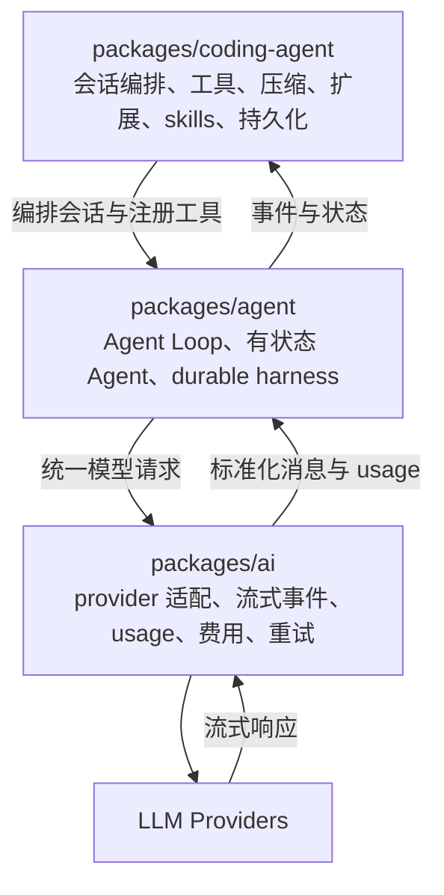
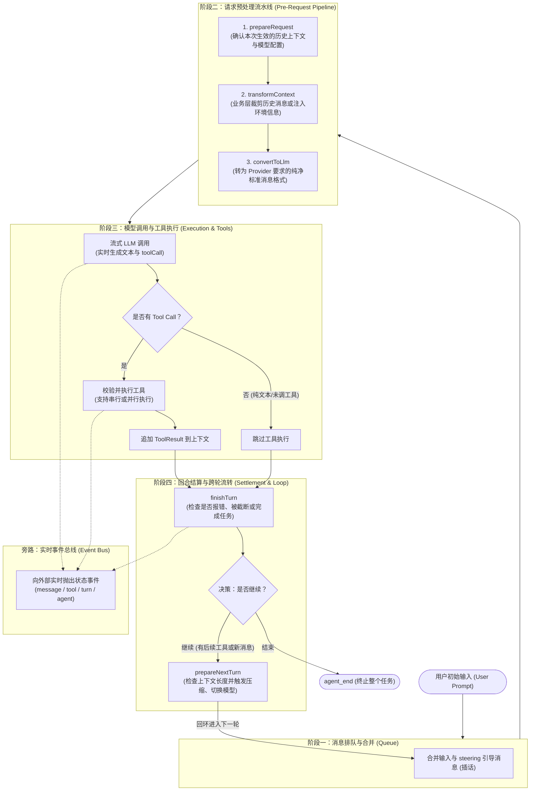

# pi 的 Harness 介绍

---

## 1. 概述

pi 是一个面向完整交互式 Coding Agent 产品的 Harness，而不是单一的评测脚本。它在模型适配、Agent 循环、会话存储和产品功能上分层清晰，上下文压缩与错误恢复成熟，能够支撑上百步的长程编程任务。

贯穿整个设计的几条核心边界原则：

1. 所有模型请求都经过统一的消息转换边界；
2. 压缩必须有 token 计账、合法切点和溢出恢复；
3. 错误和恢复过程应进入轨迹，而不是只表现为异常退出；
4. 扩展能力应挂在少量稳定生命周期点上。

---

## 2. 什么是 Agent Harness

在本文中，Harness 指围绕语言模型构建的运行框架。它不负责模型本身的推理能力，而是负责：

- 组织 system、任务、模型回复和工具结果；
- 调用模型并解析动作；
- 执行命令或工具；
- 控制步数、费用、超时和重试；
- 保存可审计轨迹；
- 在上下文过长、工具失败或模型输出不完整时决定如何恢复。

Harness 的设计直接决定 Agent 能否稳定完成长任务，也决定后续训练数据能否真实复现推理时的输入。

---

## 3. 定位与分层架构

pi 面向完整的交互式 Coding Agent 产品，而不是单一评测脚本。它采用严格分层：

其中 `packages/agent` 定义 Agent Loop 与生命周期边界，`packages/coding-agent` 承载会话编排、工具、压缩、扩展与持久化等产品能力；durable harness、TUI 与会话树属于面向交互场景的外围能力。

## 4. Agent Loop：生命周期钩子与事件流

pi 把 Agent 的执行严格拆解为四个主要阶段与一个旁路事件体系：

### 流程四阶段与旁路体系详细解析

#### 阶段一：消息排队与合并（Queue）

- **职责**：确定当前轮次开始前应该将哪些消息推入上下文。
- **具体动作**：
  - **首轮**：接收用户初始输入的 Prompt 直接启动；
  - **后续轮次**：检查并消费用户在工具执行期间发送的 **steering 引导消息（插话）**，或者上一轮压缩替换后的新消息，优先合并并推送进上下文。

#### 阶段二：请求预处理流水线（Pre-Request Pipeline）

在发起网络请求前，消息和配置必须经过三道顺序过滤：

1. **`prepareRequest`（参数与上下文确认）**：
   - 确定本次请求使用的实际模型与思考深度（例如临时调高 thinking level）；
   - 从持久化会话记录中装配出当前轮次真正生效的历史消息列表。
2. **`transformContext`（业务层内容修整）**：
   - 输入和输出都是系统内部的 `AgentMessage[]`；
   - 负责业务视角的裁剪与注入，例如清理过早的历史记录、过滤多余冗余信息、或注入最新的环境状态。
3. **`convertToLlm`（协议归一化）**：
   - 大模型 API（OpenAI/Anthropic）严格只认 `user`、`assistant`、`tool / toolResult` 三种基础角色；
   - 此步骤剥离系统内部用于 UI 渲染、附件存储的自定义字段，转换为供应商 100% 兼容的标准报文，避免接口报错。

#### 阶段三：模型调用与工具执行（Execution & Tools）

- **流式调用**：调用大模型接口，流式返回文本与结构化的工具调用请求；
- **分支判定**：
  - **无工具调用**：如果模型输出纯文本答复或中途报错，直接跳过工具执行，进入结算阶段；
  - **有工具调用**：校验参数后由工具执行器执行（支持按配置单条串行或并发执行），把执行产生的 `ToolResult` 消息追加回当前上下文；
  - **安全保护**：若模型输出因最大 token 限制被强制截断，系统会判定这批参数不完整的工具调用失败，避免执行残缺命令。

#### 阶段四：回合结算与跨轮流转（Settlement & Loop）

- **`finishTurn`（决策是否结束）**：
  - 汇总本轮模型答复与工具结果；
  - 若模型调用了退出指令、或者直接作答完毕且没有后续任务，判定结束并触发 `agent_end`。
- **`prepareNextTurn`（跨轮重型任务与压缩挂载点）**：
  - 若需要继续下一轮，在此处检查上下文累计长度；
  - **上下文压缩的触发点**：如果 token 超限，在此处调用压缩算法对早期轨迹做摘要替换；因为压缩较为耗时，放在轮次切换的间隙进行最为安全稳妥。完成后回环到阶段一。

#### 旁路体系：实时事件总线（Event Bus）

- 图右侧的虚线表示旁路通知：整个主循环在生成文字、执行工具、切换轮次时，会同步抛出 `message_start`、`tool_execution_start`、`turn_end` 等事件，供界面打字机渲染或日志记录，主循环本身不与 UI 强耦合。

## 5. 统一 LLM 请求边界 (`convertToLlm`)

大模型 API 严格只接受 `system`、`user`、`assistant`、`tool` 等标准角色，而系统内部常有自定义消息（如终端执行、压缩摘要、UI 展示等）。`convertToLlm()` 作为发给模型前的唯一一道转换门，主要完成三件事：

1. **类型降级**：把系统内部的私有条目（如压缩摘要 `compactionSummary`、命令执行 `bashExecution`）统一包装为标准的 `user` 角色纯文本，避免 API 报错；
2. **安全过滤**：集中剔除内部探活命令（标记了 `excludeFromContext` 的记录）或按配置过滤掉大体积图片；
3. **协议解耦**：上层业务和界面可以自由定义展示消息，底层的 Provider 协议差异被收敛在单一点，不污染 Agent 主循环。

## 6. 错误即数据（Error as Data）

在编程任务中，报错往往是调试与自我修正的前提。pi 不把常规执行失败当作异常抛出崩溃，而是将其编码为标准数据消息：

1. **执行报错回传**：工具参数错误、脚本执行失败等均包装为 `isError: true` 的标准工具结果，供大模型在下一轮读取报错并自我修正；
2. **截断防御**：当模型因达 Token 上限被截断（`stopReason === "length"`）时，由于参数可能不完整，系统直接拒绝执行残缺命令，改为生成失败结果消息；
3. **轨迹保真**：失败的尝试与报错信息均完整保留在会话历史中，便于完整复盘排错过程与离线分析重试逻辑。

## 7. 上下文压缩

为支持长程任务，pi 内置了上下文压缩（Compaction）机制，核心流程如下：

1. **计账**：以最近一次模型回复返回的官方 token 消耗（`usage.totalTokens`）为基准，加上其后新增消息的轻量估算（约每 4 个字符折算 1 个 Token，图片按固定当量折算），得到当前上下文总量；
2. **触发**：发起请求前若发现 `当前 Token > 模型窗口 − 预留缓冲（默认 16,384）`，即在轮次间隙触发压缩；若仍遇到上下文超限报错或模型输出因长度截断，系统会剔除残缺消息、压缩腾出空间后自动重试当前轮次（每轮限一次，防止死循环）；用户也可通过 `/compact` 命令手动触发；
3. **切点**：压缩时从最新消息向前保留约 20,000 Token 的近期上下文，切点保证 `toolCall` 与 `toolResult` 成对移动、不被拆散；
4. **摘要**：切点之前的历史序列化后（工具输出硬截断"脱水"，防止摘要请求本身超窗），按固定结构生成摘要（Goal / Constraints / Progress / Key Decisions / Next Steps / Critical Context），已有摘要时增量合并而非重新生成；`readFiles` / `modifiedFiles` 文件清单由代码直接扫描历史工具调用统计并跨次继承去重，不依赖模型记忆。

## 8. 其他成熟工程设计

除了上述核心机制之外，pi 在工程细节上还沉淀了若干实用设计：

1. **Bash 巨量输出截断（尾部优先 + 临时文件）**：
   - 针对动辄数千行的测试或编译输出，双限制截断时**优先保留末尾日志**（因为核心报错与测试结论通常在末尾）；
   - 完整未截断的原始输出实时落入临时文件（如 `/tmp/pi-bash-xxxx`），模型若需回看前文可按路径读取。
2. **重试机制分层（传输层与业务层解耦）**：
   - **底层 Provider 重试**：用指数退避静默处理网络波动、429 限流和 5xx 服务端错误，不打扰上层；
   - **快速失败**：遇到 401 认证失败、402 欠费或 400 上下文超窗等非临时错误立即上抛，绝不盲目重试；上层 Agent 仅负责业务级自愈（如压缩重试）。
3. **输出因长度截断（`stopReason=length`）严禁执行工具**：
   - 当模型因达到输出上限被硬性切断时，工具调用往往携带残缺参数（如危险的删改命令）；
   - pi 严格将截断消息内的所有工具调用全判为失败，坚决不予执行，防止引发灾难性误操作。
4. **Edit 编辑工具的可行动错误反馈**：
   - 代码替换失败时不只报简单的"失败"，而是明确提示可行动原因：是"未匹配（需检查缩进换行）"、还是"不唯一出现多次（需扩大上下文）"、还是"替换后内容无变化"，帮助模型下一轮精准修正。
5. **系统提示词与技能按需加载**：
   - System Prompt 中不预置几十个技能的全文，仅提供一份极简的 `<available_skills>` 目录（名称、说明、路径）；
   - 模型在需要时才通过 `read` 工具读取对应的 `SKILL.md`，大幅降低每轮对话的固定 Token 开销。
6. **压缩预算按模型定制与生命周期事件**：
   - 允许按不同大模型的窗口大小（如 200k vs 64k）单独覆盖预留缓冲区和保留近期 Token 数；
   - 提供 `session_before_compact` 等钩子，支持外部扩展审计、取消压缩或替换摘要模型。

## 9. 优势总结

1. **端到端闭环的上下文自愈体系**：
   将官方 API 记账、智能切点、工具输出脱水、代码文件追踪与事后溢出重试串联成闭环，有效支持长程编码任务的无人值守稳定运行，避免超窗崩溃退出。
2. **高扩展性且低侵入的生命周期钩子（Hooks）**：
   在会话启动、模型调用前后、工具执行前后、上下文压缩等关键节点均暴露了统一拦截边界，扩展功能无需魔改主循环即可灵活接入。
3. **全链路可审计的元数据与消息流**：
   模型的真实 Token 消耗、错误堆栈、压缩前后的状态变迁都作为结构化记录完整存盘，便于排查复杂问题、评估模型表现以及精确统计费用。
4. **长程复杂交互与故障恢复能力**：
   具备良好的状态持久化与断点续跑能力，在遭遇进程中断或偶发网络异常时能够精准恢复现场，适合长时间无人值守的复杂长链路编程任务。
