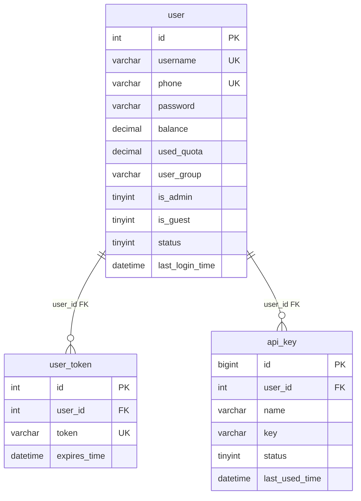

# 数据库设计文档

> 文档版本：v1.3 ｜ 更新日期：2026-10-05 ｜ 对应代码版本：v0.9.0
>
> 数据源：`backend/app/models/`（SQLAlchemy 2.0 ORM 表定义）+ `backend/app/core/database.py`（建表入口）

## 一、概述

AgenticAPI 后端使用 **MySQL** 数据库，通过 **SQLAlchemy 2.0 ORM**（异步驱动 asyncmy）定义表结构，应用启动时自动建表。

### 建表机制

1. **注册**：导入 `app.models` 包（`__init__.py`）触发所有表定义注册到 `BaseModel.metadata`；
2. **建表**：应用启动时调用 `app/core/database.py` 的 `init_database()`，执行
   `await conn.run_sync(BaseModel.metadata.create_all)`，等价于对每张表执行
   `CREATE TABLE IF NOT EXISTS`；
3. **只增不改**：`create_all` 只创建不存在的表，**不会给已存在的表新增列**。旧库升级需手动执行 DDL；
4. **新增表**：在 `app/models/` 下新建模块定义继承 `BaseModel` 的类，并在 `app/models/__init__.py` 中导入，下次启动即自动建表。

## 二、公共基类 BaseModel

所有业务表都继承 `BaseModel`（`backend/app/models/base.py`），自动获得两个公共时间字段：

| 字段            | 类型      | 默认值                       | 说明                              |
|---------------|---------|---------------------------|-----------------------------------|
| `create_time` | DateTime | `CURRENT_TIMESTAMP`       | 创建时间                             |
| `update_time` | DateTime | `CURRENT_TIMESTAMP`（更新时刷新） | 更新时间，`onupdate=CURRENT_TIMESTAMP` |

> 例外：`system_config` 表以 `config_key` 为主键、无独立 `id`，但仍继承 `BaseModel`，故同样带这两个时间字段。

## 三、表清单总览

共 **13 张表**，按职责分为六组：

| 分组      | 表名              | ORM 类               | 所在文件              | 用途                       |
|---------|------------------|---------------------|-------------------|--------------------------|
| 用户与凭证   | `user`           | `UserTabel`         | `user.py`         | 用户基本信息、余额、分组、状态          |
|         | `user_token`     | `UserTokenTabel`    | `user.py`         | 登录令牌（uuid4，有过期时间）         |
|         | `api_key`        | `ApiKeyTable`       | `api_key.py`      | 对外中转接口的 `sk-` 访问密钥        |
| 充值      | `redeem_code`    | `RedeemCodeTable`   | `redeem_code.py`  | 兑换码（面值、三态状态、批次、核销快照）      |
| 中转配置    | `llm_models`     | `ModelsTable`       | `llm_model.py`    | 模型配置（定价、分组、能力开关、渠道绑定）     |
|         | `llm_channels`   | `ChannelsTable`     | `llm_channel.py`  | 上游渠道配置（地址、密钥、支持模型）        |
| 调用与计费   | `logs`           | `LogsTable`         | `log.py`         | 统一系统日志（API 调用 / 登录 / 管理 / 用户） |
|         | `chat_record`    | `ChatRecordTable`   | `chat_record.py` | 对话全文记录（输入 / 推理 / 输出）      |
| 监控统计    | `usage_stats`    | `UsageStatsTable`   | `usage_stats.py` | 用量预聚合（用户×模型×小时桶）          |
|         | `usage_summary`  | `UsageSummaryTable` | `usage_summary.py`| 全站累计计数器（固定单行 id=1）        |
|         | `system_config`  | `SystemConfigTable` | `system_config.py`| 运行时键值配置（如对话记录阈值）          |
| 维护 Agent | `agent_session`  | `AgentSessionTable` | `agent_session.py`| 维护 Agent 会话（模型、安全开关、保留策略）   |
|         | `agent_message`  | `AgentMessageTable` | `agent_message.py`| 维护 Agent 消息轨迹（含工具调用与审批状态）   |

## 四、表关系总览

下图只画**真实外键**关系（实线）。模型与渠道之间、以及日志/记录类表与 user 之间的关联采用**软关联 / 快照**（见第五节说明），不在数据库层建外键。

**软关联 / 逻辑关联（无数据库外键）：**

- `llm_models.channels`（TEXT，JSON 数组）按顺序存放渠道名，逻辑指向 `llm_channels.channel_name`；
- `llm_channels.support_models`（TEXT，JSON 数组）存放模型名，逻辑指向 `llm_models.name`；
- `logs.user_id`、`chat_record.user_id`、`usage_stats.user_id` 逻辑指向 `user.id`，但**故意不建外键**（见下节）；
- `redeem_code.used_by` 逻辑指向 `user.id`，同样**故意不建外键**并冗余 `used_username` 快照（同 logs 惯例，用户删除后兑换记录仍可读）；
- `logs.model_name` / `chat_record.model_name` / `usage_stats.model_name` 逻辑指向 `llm_models.name`（**对外名**，不记 `upstream_name`，保证监控按模型维度统计一致）；
- `agent_session.user_id` 逻辑指向 `user.id`、`agent_message.session_id` 逻辑指向 `agent_session.id`，均**故意不建外键**（应用层联动删除，见 5.12 / 5.13）。

## 五、逐表详细设计

### 5.1 `user` -- 用户信息表

- **ORM 类**：`UserTabel`（`user.py`）
- **用途**：注册用户与访客账号的统一信息表；承载余额、分组、管理员、封禁等账号维度属性。

| 字段               | 类型            | 可空   | 默认值     | 说明                          |
|------------------|---------------|-------|---------|-----------------------------|
| `id`             | Integer       | 否（PK） | 自增      | 用户 ID                       |
| `username`       | String(50)    | 否     | -       | 用户名，唯一                      |
| `password`       | String(255)   | 否     | -       | 密码（bcrypt 哈希存储，不可逆）          |
| `nickname`       | String(50)    | 是     | -       | 昵称                          |
| `phone`          | String(20)    | 是     | -       | 手机号，唯一                      |
| `is_guest`       | Boolean       | 否     | 0       | 是否为访客账号（`/user/guest` 创建）   |
| `is_admin`       | Boolean       | 否     | 0       | 是否为管理员                      |
| `balance`        | DECIMAL(12,6) | 否     | 0       | 账户余额（单位与模型定价一致，每百万 token 价） |
| `used_quota`     | DECIMAL(12,6) | 否     | 0       | 累计消费金额                      |
| `user_group`     | String(20)    | 否     | `free`  | 用户分组：`free` / `vip`         |
| `status`         | Integer（布尔语义） | 否     | 1       | 账号状态：0 封禁 / 1 正常            |
| `last_login_time`| DateTime      | 是     | -       | 最后登录时间                      |
| `create_time`    | DateTime      | 否     | 当前时间    | 创建时间（继承基类）                  |
| `update_time`    | DateTime      | 否     | 当前时间    | 更新时间（继承基类）                  |

- **索引**：`username_UNIQUE`（username）、`phone_UNIQUE`（phone）。
- **设计要点**：金额字段一律 `DECIMAL`，避免浮点误差；分组机制上 **正式注册统一进 `vip`**（`create_user` 显式传值，可调全部分组模型）、**访客固定 `free`**（`create_guest_user` 显式传值，仅免费模型），列默认值保持 `free` 作最小权限兜底；`free` 分组只能调用 `free` 分组模型，`vip` 可调全部；访客 `is_guest` 仅作数据标记，权限与普通用户一致，过期访客惰性清理。

### 5.2 `user_token` -- 用户登录令牌表

- **ORM 类**：`UserTokenTabel`（`user.py`）
- **用途**：存放登录态的不透明令牌（uuid4），正式账号 30 天、访客 24 小时有效，登出即时删除。

| 字段             | 类型         | 可空   | 默认值 | 说明                 |
|----------------|------------|-------|-----|----------------------|
| `id`           | Integer    | 否（PK） | 自增  | 令牌 ID               |
| `user_id`      | Integer    | 否（FK） | -   | 所属用户 ID（-> `user.id`）|
| `token`        | String(255)| 否     | -   | 令牌值，唯一             |
| `expires_time` | DateTime   | 否     | -   | 过期时间               |
| `create_time`  | DateTime   | 否     | 当前时间 | 创建时间（继承基类）        |
| `update_time`  | DateTime   | 否     | 当前时间 | 更新时间（继承基类）        |

- **索引**：`token_UNIQUE`（token）、`fk_user_token_user_idx`（user_id）。
- **外键**：`user_id` -> `user.id`。
- **说明**：与 `api_key` 区分--本表令牌用于站内登录态，`api_key` 用于对外中转接口鉴权。

### 5.3 `api_key` -- 用户 API 密钥表

- **ORM 类**：`ApiKeyTable`（`api_key.py`）
- **用途**：对外中转接口 `POST /v1/chat/completions` 的访问凭证（`sk-` 开头），每用户最多 5 个。

| 字段              | 类型         | 可空   | 默认值 | 说明                    |
|-----------------|------------|-------|-----|-----------------------|
| `id`            | BigInteger | 否（PK） | 自增  | 密钥 ID                 |
| `user_id`       | FK->user.id | 否     | -   | 所属用户 ID（-> `user.id`）  |
| `name`          | String(50) | 否     | -   | 密钥备注名                |
| `key`           | String(64) | 否     | -   | API 密钥值（`sk-` 开头）     |
| `status`        | Integer（布尔语义） | 否     | 1   | 状态：0 禁用 / 1 启用        |
| `last_used_time`| DateTime   | 是     | -   | 最后使用时间               |
| `create_time`   | DateTime   | 否     | 当前时间 | 创建时间（继承基类）           |
| `update_time`   | DateTime   | 否     | 当前时间 | 更新时间（继承基类）           |

- **索引**：`uk_api_key`（key）、`idx_api_key_user`（user_id）。
- **外键**：`user_id` -> `user.id`。

### 5.4 `redeem_code` -- 兑换码表

- **ORM 类**：`RedeemCodeTable`（`redeem_code.py`）
- **用途**：管理员批量生成的充值兑换码，用户核销后按面值充值余额（零支付通道的充值方式，见 README 版本 v0.8.0）。

| 字段               | 类型            | 可空   | 默认值  | 说明                            |
|------------------|---------------|-------|------|-------------------------------|
| `id`             | BigInteger    | 否（PK） | 自增   | 兑换码 ID                        |
| `code`           | String(64)    | 否     | -    | 兑换码值（`AGC-` 前缀 + 去混淆字符集随机串）  |
| `amount`         | DECIMAL(12,6) | 否     | -    | 面值（元，核销后充值到 `user.balance`）   |
| `status`         | Integer       | 否     | 1    | 状态：0 已停用 / 1 未使用 / 2 已使用      |
| `batch_no`       | String(32)    | 否     | `''` | 批次号（同一次生成的标识，留空自动生成）         |
| `remark`         | String(255)   | 是     | -    | 备注                            |
| `used_by`        | Integer       | 是     | -    | 核销用户 ID（软关联 `user.id`，无外键）    |
| `used_username`  | String(50)    | 是     | -    | 核销用户名快照                       |
| `used_time`      | DateTime      | 是     | -    | 核销时间                          |
| `create_time`    | DateTime      | 否     | 当前时间 | 创建时间（继承基类）                    |
| `update_time`    | DateTime      | 否     | 当前时间 | 更新时间（继承基类）                    |

- **索引**：`uk_redeem_code`（code 唯一）、`idx_redeem_batch`（batch_no）、`idx_redeem_used_by`（used_by）。
- **设计要点**：
  - 三态状态机：`1 未使用 → 2 已使用`（核销）；`1 → 0 已停用`（管理端停用，仅未使用可停）。核销时以「SELECT FOR UPDATE 锁行 + 状态校验」防并发重复核销；
  - 码值用 `secrets.choice` 自定义去混淆字符集（去掉 0/O/1/I）生成 `AGC-XXXXX-XXXXX-XXXXX`，32^15 组合碰撞概率可忽略；
  - 核销加余额与中转计费扣减对称：`UPDATE user SET balance = balance + 面值`（列表达式服务端原子执行），核销、加余额、写日志（`write_log` `auto_commit=False`）在同一事务一次提交；
  - 用户「我的兑换记录」直接查 `used_by = 当前用户 AND status = 2`，不另建记录表；
  - 不做有效期（本期），管理上以「停用」兜底。

### 5.5 `llm_models` -- AI 大模型配置表

- **ORM 类**：`ModelsTable`（`llm_model.py`）
- **用途**：对外提供的模型清单与计费、能力配置；中转链路据此做模型校验、分组权限、定价扣费。

| 字段                 | 类型            | 可空   | 默认值   | 说明                            |
|--------------------|---------------|-------|-------|-------------------------------|
| `id`               | BigInteger    | 否（PK） | 自增    | 主键 ID                         |
| `name`             | String(128)   | 否     | -     | 模型唯一标识名称（对外展示名，唯一）           |
| `upstream_name`    | String(128)   | 是     | -     | 实际请求上游用的模型名，为空时回退到 `name`     |
| `label`            | String(128)   | 否     | -     | 前端展示名称                        |
| `description`      | Text          | 是     | -     | 模型描述                          |
| `is_request_mode`  | Integer（布尔语义） | 否     | 0     | 是否按次计费：0 否 / 1 是              |
| `per_request_price`| DECIMAL(12,4) | 否     | 0     | 单次请求价格（按次计费时生效）               |
| `input_price`      | DECIMAL(12,4) | 否     | 0     | 输入 token 单价                   |
| `cache_price`      | DECIMAL(12,4) | 否     | 0     | 缓存 token 单价                   |
| `output_price`     | DECIMAL(12,4) | 否     | 0     | 输出 token 单价                   |
| `model_group`      | String(64)    | 否     | -     | 模型分组：`free` 免费 / `vip` 付费     |
| `is_pin`           | Integer（布尔语义） | 否     | 0     | 是否置顶                          |
| `is_log`           | Integer（布尔语义） | 否     | 0     | 是否开启对话全文记录（控制 `chat_record` 落库）|
| `status`           | Integer（布尔语义） | 否     | 1     | 状态：0 禁用 / 1 启用                |
| `channels`         | Text          | 是     | -     | 上游渠道有序列表（JSON 数组，按顺序轮询）       |
| `context_length`   | Integer       | 是     | -     | 模型最大上下文总 token 长度             |
| `max_tokens`       | Integer       | 是     | -     | 最大输出 token 数量限制               |
| `support_vision`   | Integer（布尔语义） | 否     | 0     | 是否支持视觉识图：0 不支持 / 1 支持         |
| `icon`             | String(255)   | 否     | `''`  | 模型图标                          |
| `create_time`      | DateTime      | 否     | 当前时间  | 创建时间（继承基类）                    |
| `update_time`      | DateTime      | 否     | 当前时间  | 更新时间（继承基类）                    |

- **唯一约束**：`uk_model_name`（name）。
- **设计要点**：定价单位为「每百万 token」；缓存命中 token 按缓存价计、不重复收输入价；`is_request_mode=1` 时固定按 `per_request_price` 计次；`channels` 字段以 JSON 数组软关联 `llm_channels.channel_name`，不建外键以便灵活调整。
- **模型映射**：`name` 为对外展示名（调用方用此名调用），`upstream_name` 为发往上游的实际模型名；中转链路在转发请求时用 `upstream_name` 替换请求体的 `model` 字段，响应里再把上游名还原为 `name`（非流式替换顶层 `model`，流式逐个 SSE 事件替换）。`upstream_name` 为空时回退 `name`，整条链路原样透传、零开销。日志 / 用量统计 / 对话记录一律记 `name`（对外名），监控按模型维度统计不受映射影响。

### 5.6 `llm_channels` -- 上游 AI 渠道配置表

- **ORM 类**：`ChannelsTable`（`llm_channel.py`）
- **用途**：登记上游供应商渠道（地址、密钥、支持模型），供模型轮询转发。

| 字段              | 类型           | 可空   | 默认值  | 说明                          |
|-----------------|--------------|-------|------|-----------------------------|
| `id`            | BigInteger   | 否（PK） | 自增   | 主键 ID                       |
| `channel_name`  | String(128)  | 否     | -    | 渠道展示名称（唯一，后台管理员查看）          |
| `base_url`      | String(255)  | 否     | -    | 上游接口基础地址                    |
| `api_key`       | String(512)  | 否     | -    | 上游接口密钥                      |
| `support_models`| Text         | 是     | -    | 支持的模型列表（JSON 数组，软关联模型名）     |
| `status`        | Integer      | 否     | 1    | 渠道状态：0 禁用 / 1 启用            |
| `timeout`       | Integer      | 否     | 30   | 请求超时时间（秒）                   |
| `used_ratio`    | Float        | 否     | 0    | 使用率（百分数）                    |
| `description`   | Text         | 是     | -    | 渠道备注说明                      |
| `create_time`   | DateTime     | 否     | 当前时间 | 创建时间（继承基类）                  |
| `update_time`   | DateTime     | 否     | 当前时间 | 更新时间（继承基类）                  |

- **唯一约束**：`uk_channel_name`（channel_name）。
- **设计要点**：`support_models` 为 JSON 数组软关联 `llm_models.name`，与 `llm_models.channels` 形成双向逻辑引用但无外键。

### 5.7 `logs` -- 系统日志表

- **ORM 类**：`LogsTable`（`log.py`）
- **用途**：统一宽表记录四类日志--`api`（中转调用）、`login`（登录/注册/登出/访客）、`admin`（管理员操作）、`user`（密钥管理等）。`api` 类专属字段对其他类型留空。

| 字段                 | 类型            | 可空   | 默认值 | 说明                          |
|--------------------|---------------|-------|-----|-----------------------------|
| `id`               | BigInteger    | 否（PK） | 自增  | 日志 ID                       |
| `type`             | String(20)    | 否     | -   | 日志类型（带索引）：api / login / admin / user |
| `user_id`          | Integer       | 是     | -   | 用户 ID（快照，**无外键**）           |
| `username`         | String(50)    | 是     | -   | 用户名快照                       |
| `action`           | String(50)    | 否     | -   | 动作：chat / login / create_model / update_user 等 |
| `detail`           | String(500)   | 是     | -   | 粗略描述                        |
| `model_name`       | String(128)   | 是     | -   | 调用的模型名（api 类专用）             |
| `channel_name`     | String(128)   | 是     | -   | 实际使用的上游渠道（api 类专用）          |
| `prompt_tokens`    | Integer       | 否     | 0   | 输入 token 数（api 类专用）         |
| `completion_tokens`| Integer       | 否     | 0   | 输出 token 数（api 类专用）         |
| `cache_tokens`     | Integer       | 否     | 0   | 缓存命中 token 数（api 类专用）       |
| `cost`             | DECIMAL(12,6) | 否     | 0   | 本次消费金额（api 类专用）             |
| `duration_ms`      | Integer       | 是     | -   | 请求耗时（毫秒，api 类专用）            |
| `create_time`      | DateTime      | 否     | 当前时间 | 创建时间（继承基类）                  |
| `update_time`      | DateTime      | 否     | 当前时间 | 更新时间（继承基类）                  |

- **索引**：`type`。
- **设计要点**：`user_id` 不设外键--用户被删除后日志仍需保留审计痕迹，`username` 存快照便于查阅；工坊调用也写此表，`cost=0` 且 `detail` 标注「工坊」。

### 5.8 `chat_record` -- 大模型对话记录表

- **ORM 类**：`ChatRecordTable`（`chat_record.py`）
- **用途**：保存调用的输入 / 推理 / 输出全文，供监控面板「对话数据」标签行展开查看。

| 字段                 | 类型            | 可空   | 默认值 | 说明                          |
|--------------------|---------------|-------|-----|-----------------------------|
| `id`               | BigInteger    | 否（PK） | 自增  | 记录 ID                       |
| `user_id`          | Integer       | 否     | -   | 用户 ID（快照，**无外键**）           |
| `username`         | String(50)    | 否     | -   | 用户名快照                       |
| `model_name`       | String(128)   | 否     | -   | 调用的模型名                      |
| `channel_name`     | String(128)   | 是     | -   | 实际使用的上游渠道                   |
| `input_content`    | Text          | 是     | -   | 输入内容（messages 数组 JSON）      |
| `reasoning_content`| Text          | 是     | -   | 模型推理内容（思维链，无则留空）            |
| `output_content`   | Text          | 是     | -   | 模型输出内容                      |
| `prompt_tokens`    | Integer       | 否     | 0   | 输入 token 数                  |
| `completion_tokens`| Integer       | 否     | 0   | 输出 token 数                  |
| `cache_tokens`     | Integer       | 否     | 0   | 缓存命中 token 数                |
| `cost`             | DECIMAL(12,6) | 否     | 0   | 本次消费金额                      |
| `duration_ms`      | Integer       | 是     | -   | 请求耗时（毫秒）                    |
| `create_time`      | DateTime      | 否     | 当前时间 | 创建时间（继承基类）                  |
| `update_time`      | DateTime      | 否     | 当前时间 | 更新时间（继承基类）                  |

- **索引**：`idx_chat_record_user_id`（user_id）、`idx_chat_record_model_name`（model_name）。
- **写入条件**：仅当模型 `is_log=1` 且 输入+输出 token ≤ `system_config.chat_record_max_tokens`（默认 5000）时落库，避免超长文本入库。token 数量本身无条件记入 `logs` 与 `usage_stats`。
- **设计要点**：冗余 `username` 快照供管理员按用户名筛选，避免联表；`user_id` 无外键（同 logs）。

### 5.9 `usage_stats` -- 用量统计小时桶表（预聚合）

- **ORM 类**：`UsageStatsTable`（`usage_stats.py`）
- **用途**：监控面板折线图与范围统计的数据源，避免对 `logs` 原始日志全量扫描求和。

| 字段                 | 类型         | 可空   | 默认值 | 说明                          |
|--------------------|------------|-------|-----|-----------------------------|
| `id`               | BigInteger | 否（PK） | 自增  | 主键 ID                       |
| `stat_hour`        | DateTime   | 否     | -   | 统计小时（整点）                    |
| `user_id`          | Integer    | 否     | -   | 用户 ID                       |
| `model_name`       | String(128)| 否     | -   | 模型名                         |
| `calls`            | BigInteger | 否     | 0   | 调用次数                        |
| `prompt_tokens`    | BigInteger | 否     | 0   | 输入 token 累计                 |
| `completion_tokens`| BigInteger | 否     | 0   | 输出 token 累计                 |
| `cache_tokens`     | BigInteger | 否     | 0   | 缓存 token 累计                 |
| `create_time`      | DateTime   | 否     | 当前时间 | 创建时间（继承基类）                  |
| `update_time`      | DateTime   | 否     | 当前时间 | 更新时间（继承基类）                  |

- **唯一约束**：`uk_stats_hour_user_model`（stat_hour, user_id, model_name）--支撑 upsert，同一小时同一用户同一模型只累加不新增行。
- **索引**：`idx_stats_user_hour`（user_id, stat_hour）。
- **写入方式**：中转每次调用成功后用 `INSERT ... ON DUPLICATE KEY UPDATE` 单语句原子累加。

### 5.10 `usage_summary` -- 全站用量汇总表（单行计数器）

- **ORM 类**：`UsageSummaryTable`（`usage_summary.py`）
- **用途**：监控面板「全站累计 token」卡片直接读这一行，O(1) 无需聚合计算。

| 字段                 | 类型         | 可空   | 默认值 | 说明            |
|--------------------|------------|-------|-----|---------------|
| `id`               | Integer    | 否（PK） | 自增  | 固定为 1（单行）     |
| `calls`            | BigInteger | 否     | 0   | 全站累计调用次数      |
| `prompt_tokens`    | BigInteger | 否     | 0   | 全站累计输入 token  |
| `completion_tokens`| BigInteger | 否     | 0   | 全站累计输出 token  |
| `cache_tokens`     | BigInteger | 否     | 0   | 全站累计缓存 token  |
| `create_time`      | DateTime   | 否     | 当前时间 | 创建时间（继承基类）    |
| `update_time`      | DateTime   | 否     | 当前时间 | 更新时间（继承基类）    |

- **设计要点**：固定单行（`id=1`）计数器模式，每次中转调用成功后原子累加。

### 5.11 `system_config` -- 系统配置表（键值对）

- **ORM 类**：`SystemConfigTable`（`system_config.py`）
- **用途**：管理员可在控制台调整的运行时参数，键值对存储。

| 字段             | 类型         | 可空   | 默认值 | 说明                       |
|----------------|------------|-------|-----|--------------------------|
| `config_key`   | String(64) | 否（PK） | -   | 配置键（主键，无独立 id）           |
| `config_value` | String(255)| 否     | -   | 配置值（字符串存储，按需转换类型）        |
| `create_time`  | DateTime   | 否     | 当前时间 | 创建时间（继承基类）               |
| `update_time`  | DateTime   | 否     | 当前时间 | 更新时间（继承基类）               |

- **已知键**：`chat_record_max_tokens`--对话记录长度阈值，输入+输出 token 超过此值不落库 `chat_record`，默认 5000。

### 5.12 `agent_session` -- 站点维护 Agent 会话表

- **ORM 类**：`AgentSessionTable`（`agent_session.py`）
- **用途**：一次完整的管理员-维护 Agent 对话（控制台「维护Agent」页，见 README 版本 v0.9.0）。记录驱动模型与两个安全开关；消息本体在 `agent_message`，删除会话时应用层联动删除。

| 字段               | 类型           | 可空   | 默认值       | 说明                                       |
|------------------|--------------|-------|-----------|------------------------------------------|
| `id`             | Integer      | 否（PK） | 自增        | 会话 ID                                    |
| `user_id`        | Integer      | 否     | -         | 管理员用户 ID（软关联 `user.id`，无外键）              |
| `title`          | String(128)  | 否     | `新会话`     | 会话标题（首轮对话后自动生成）                          |
| `model_name`     | String(128)  | 否     | -         | 当前驱动模型（站内模型对外名，会话中可切换）                   |
| `auto_approve_l1`| Boolean      | 否     | `0`       | L1 工具自动批准开关：开启后低危写工具跳过审批卡片（`always_confirm` 工具不受豁免） |
| `enable_l2`      | Boolean      | 否     | `1`       | L2 高危工具启用开关：关闭后高危工具不注入 tools（只读模式会话）      |
| `status`         | String(16)   | 否     | `active`  | 会话状态：`active` / `archived`                |
| `create_time`    | DateTime     | 否     | 当前时间      | 创建时间（继承基类）                               |
| `update_time`    | DateTime     | 否     | 当前时间      | 更新时间（继承基类）                               |

- **索引**：`idx_agent_session_user`（user_id）。
- **设计要点**：
  - 保留策略：每用户最近 50 个 + 近 30 天，新建会话时惰性清理（`crud/agent.py` 的 `gc_sessions`，清理动作写 `logs` type=admin 流水）；
  - 会话进行中置内存级 `_RUNNING` 锁（同会话并发对话返回 409），崩溃残留锁随进程消失，重启后凭 `repair_dangling_tool_calls` 修复悬空 tool 消息；
  - 接口全部要求管理员（`get_current_admin`），会话只能查/改自己的。

### 5.13 `agent_message` -- 站点维护 Agent 消息表

- **ORM 类**：`AgentMessageTable`（`agent_message.py`）
- **用途**：维护 Agent 会话的完整消息轨迹，含工具调用与审批状态变迁。审计双轨的一轨（另一轨是 `logs` 的 type=admin 工具流水，记录脱敏后的参数与截断后的结果摘要）。

| 字段                 | 类型         | 可空   | 默认值     | 说明                                                |
|--------------------|------------|-------|---------|---------------------------------------------------|
| `id`               | BigInteger | 否（PK） | 自增      | 消息 ID                                             |
| `session_id`       | Integer    | 否     | -       | 所属会话 ID（软关联 `agent_session.id`，无外键）              |
| `role`             | String(16) | 否     | -       | 角色：`user` / `assistant` / `tool` / `system`        |
| `content`          | Text       | 是     | -       | 消息正文（user/assistant 文本，tool 为结果 JSON——**落库前已经 `redact()` 脱敏，库里不存密钥**） |
| `tool_calls`       | JSON       | 是     | -       | assistant 发起的工具调用数组 `[{id, type, function: {name, arguments}}]`（含参数原文） |
| `tool_call_id`     | String(64) | 是     | -       | tool 消息回指的调用 ID                                    |
| `risk_level`       | String(4)  | 是     | -       | 工具风险等级：`L0` 只读 / `L1` 低危写 / `L2` 高危写             |
| `approval_status`  | String(16) | 否     | `none`  | 审批状态：`none` / `pending` / `approved` / `rejected` / `timeout` |
| `prompt_tokens`    | Integer    | 否     | 0       | 输入 token 数（assistant 消息，每轮分别记录）                   |
| `completion_tokens`| Integer    | 否     | 0       | 输出 token 数（assistant 消息）                           |
| `create_time`      | DateTime   | 否     | 当前时间    | 创建时间（继承基类）                                        |
| `update_time`      | DateTime   | 否     | 当前时间    | 更新时间（继承基类）                                        |

- **索引**：`idx_agent_message_session`（session_id, id 联合，会话内按序翻页）。
- **设计要点**：
  - 工具结果先经 `redact()` 递归脱敏（键名/值形态双识别，密钥只留 `前3****后4` 掩码）再截断到 8KB 落库，双保险保证库里与前端均无密钥原文；
  - `count_l2_executed` 以 `approval_status='approved' AND content NOT LIKE '%"isError": true%'` 统计会话内 L2 实删次数，配合每会话 ≤5 次的硬护栏；
  - asyncmy 驱动下原生 SQL 读 JSON 列返回字符串，`crud/agent.py` 的 `list_messages` 统一 `json.loads` 还原；
  - 删除会话时按 `session_id` 联动删除全部消息（应用层事务内完成）。

## 六、设计约定

1. **建表只增不改**：`create_all` 不会给已存在的表加列，新增字段需手动 DDL 或重建库。
2. **金额用 DECIMAL**：`balance` / `used_quota` / 各类 `price` / `cost` 一律 `DECIMAL`，避免浮点误差；token 计数在大表（`usage_stats` / `usage_summary`）用 `BigInteger` 防溢出。
3. **布尔语义用整型**：`status`、`is_*`、`is_request_mode` 等在 Python 侧为 `bool`，落库为 `Integer`（MySQL `TINYINT`/`INT`），取值 0/1。
4. **审计类表故意去外键**：`logs` / `chat_record` 的 `user_id` 不建外键并冗余 `username` 快照，保证用户删除后审计记录可读可留。
5. **JSON-in-TEXT 软关联**：`llm_models.channels` 与 `llm_channels.support_models` 以 JSON 数组互引对方名称，换取配置灵活性，牺牲数据库层完整性约束。
6. **预聚合替代全量求和**：监控统计走 `usage_stats`（小时桶，upsert 累加）+ `usage_summary`（单行计数器）两张小表，不对 `logs` 做原始全量扫描。
7. **公共时间字段**：所有表经 `BaseModel` 统一获得 `create_time` / `update_time`，由数据库 `CURRENT_TIMESTAMP` 维护。
8. **新增表流程**：在 `app/models/` 下新建模块定义继承 `BaseModel` 的类，并在 `app/models/__init__.py` 中导入，下次启动即自动建表。
