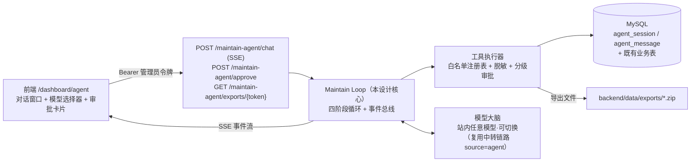
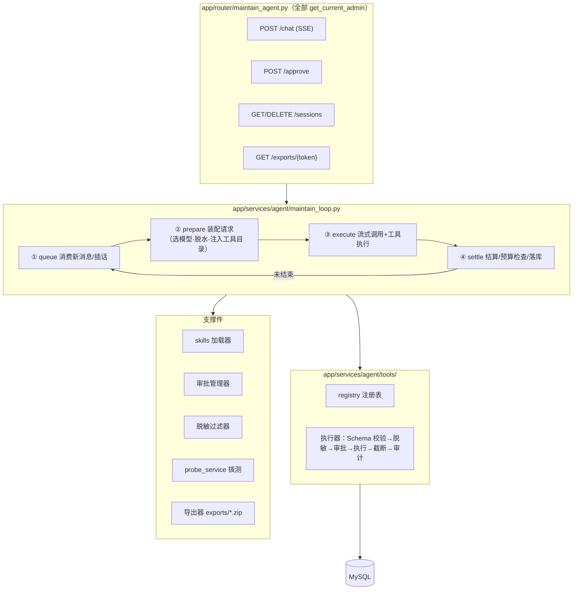
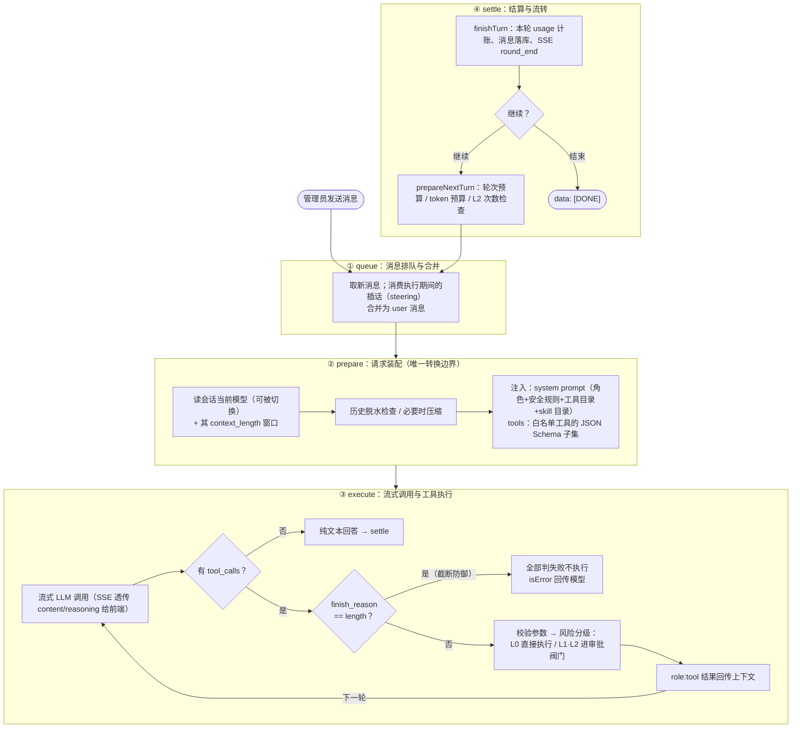
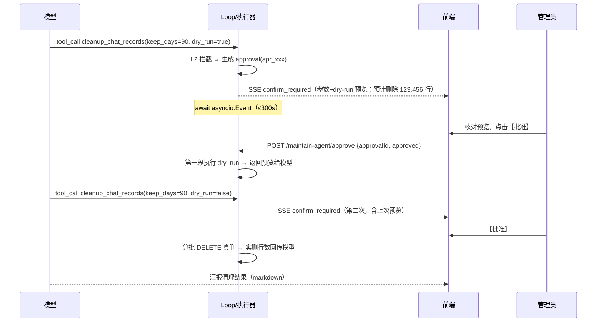

# AgenticAPI 站点维护 Agent · 形态设计（Harness 设计）

> 文档版本：v1.0（设计稿，未实施） ｜ 日期：2026-10-05 ｜ 配套文档：[维护Agent功能清单.md](维护Agent功能清单.md)
>
> 参考资料：[pi的Harness介绍.md](pi的Harness介绍.md)（借鉴其 Loop 分阶段、Error as Data、截断防御、Skills 按需加载等机制，按本站形态改造，详见第 2 节对照表）

## 1. 一句话形态

**"白名单工具 + 服务端工具循环 + 人审阀门 + 站内模型即 Provider"的对话式运维 Agent**：

- **大脑可插拔**：管理员可随时把 Agent 的驱动模型切换为站内对外提供的任意模型（走中转链路，天然享受渠道轮询容错），而不是事先写死的某个模型；
- **手是白名单**：约 22 个封闭注册的工具（见功能清单），无 shell、无任意命令、无通用文件系统访问；
- **高危有阀门**：L1/L2 写操作必须经管理员在审批卡片上确认，工具内部还有 dry-run 两段式第二道闸；
- **全程留痕**：会话消息（含工具轨迹与审批轨迹）服务端持久化，工具执行另写 `logs` 审计。



## 2. 与 pi 的对照：借鉴什么、改造什么、不要什么

| pi 机制 | 本设计处理 | 说明 |
|---|---|---|
| 四阶段 Loop（Queue → Pre-Request → Execute → Settle）+ 旁路事件总线 | **采纳** | 映射为 `maintain_loop` 的四个函数边界；SSE 扩展事件即事件总线（第 11 节） |
| `convertToLlm` 统一请求边界 | **采纳（合并简化）** | 我们的消息本身就是标准 OpenAI 格式，脱水/过滤/协议剥离统一收口在"请求装配"一处（第 9 节） |
| Error as Data（错误回传模型自愈） | **采纳** | 工具失败一律包装 `{isError: true, message}` 回传，模型下一轮自我修正（如纠正渠道名拼写） |
| 输出截断时严禁执行工具 | **采纳** | `finish_reason == "length"` 时本轮全部 tool_calls 判失败不执行（防残缺参数触发危险操作） |
| 工具巨量输出截断（尾部优先 + 临时文件） | **采纳变体** | 无文件系统工具 → 改为"JSON 摘要化截断（保留首尾条目 + 计数）+ 导出类只回下载链接"，明细落 zip 不进上下文 |
| 重试分层（传输层静默 / 业务层快速失败） | **采纳变体** | 传输层容错 = 中转链路的渠道轮询（已有能力）；401/403/400 类快速失败交模型或管理员处理 |
| 上下文压缩（计账/切点/结构化摘要） | **简化采纳** | 短程运维场景以"工具结果脱水"为主，超窗才触发结构化摘要；模型窗口直接读 `llm_models.context_length`（第 9 节） |
| Skills 按需加载（目录 + read 工具） | **采纳** | system prompt 只注入目录，`load_skill` 工具按需读全文（第 7 节） |
| steering 插话（执行中消息排队合并） | **采纳** | 执行期间的新消息入 `agent_message` 队列，下一轮 Queue 阶段合并（第 4 节） |
| durable harness / 断点续跑 | **简化** | 会话与审批状态持久化；进程重启后未决审批自动置 timeout，管理员重发即可，不做自动续跑 |
| bash / 文件系统 / Edit 等通用工具 | **不采用（红线）** | 运维 Agent 与 Coding Agent 的本质区别：封闭白名单，杜绝注入演变成任意执行 |
| 模型 = 固定 Provider 配置 | **反向改造（本设计特色）** | 站内模型即 Provider：任何出站模型都能当大脑，会话中途可切换（第 5 节） |

## 3. 分层架构



设计原则（自 pi 的边界原则改造）：

1. 所有模型请求经过**同一处请求装配边界**（模型选择、脱水、工具目录注入在此集中）；
2. 错误与审批过程**进入轨迹**（消息表），而不是只表现为异常或静默执行；
3. 扩展能力（新工具、新 skill）只挂在**注册表**两个稳定点上，不改主循环；
4. 密钥只在 `probe_service` / 中转链路内部存在，任何工具返回值经过 `redact()` 后才进入模型上下文与前端。

## 4. Agent Loop：四阶段 + 事件总线



关键参数（护栏）：

| 护栏 | 默认值 | 说明 |
|---|---|---|
| `MAX_TOOL_ROUNDS` | 24 | 单次用户消息触发的工具循环轮数上限，防死循环烧 token |
| 单工具超时 | 30s（批测类工具自声明 180s） | 工具自注册 timeout，超时返回 isError |
| 会话 token 预算 | 200k（会话设置可调） | 累计 usage 超预算 → Agent 汇报后停止 |
| L2 每会话执行上限 | 5 次 | 超出强制拒绝并提示走管理页 |
| 审批等待超时 | 300s | 超时自动拒绝（rejected_by_timeout） |

事件总线（旁路）：主循环在文本增量、工具起止、审批请求、模型切换、轮次结束时抛出结构化事件，全部走 SSE 扩展字段 `agenticapi_agent`（复刻现有 `agenticapi_search` 的前后端模式），主循环不与 UI 耦合。事件清单见第 11 节。

## 5. 模型接入与模型切换（站内模型即 Provider）

这是本设计与 pi（固定 Provider 配置）差异最大、也是本站独有优势的部分：**中转站自己就是模型的聚合入口**。

### 5.1 调用通道

Agent 大脑的每次请求**不走独立的 LLM SDK，而走本站中转链路**：

```
maintain_loop
  └─ relay_service（扩展 source="agent"）
       ├─ resolve_target：模型校验 + 分组权限（管理员 = vip，全模型可用）
       ├─ 渠道顺序轮询 + 失败自动切换（传输层容错白拿）
       ├─ 模型名映射（upstream_name 还原）照常生效
       ├─ 计费照常：按模型定价扣管理员个人余额，cost 如实写 logs（已决策，复用现有计费链路）
       ├─ 保留：usage 用量统计（Agent 自身成本可观测）
       └─ 唯一差异：不写 chat_record（维护对话独立存储，见第 10 节）
```

对 `relay_service` 的改动仅是 source 白名单加 `"agent"` 分支：计费、日志、统计行为与 `relay` 完全一致，唯一差异是不写 chat_record——否则维护对话（含工具结果全文）会混进业务对话监控页，且与 agent_message 表重复存储（分支写法与工坊 `studio` 分支同款成熟）。tools 参数随 payload 透传（工坊 web_search 已验证该路径可行）。

### 5.2 模型选择与切换

| 途径 | 操作 | 生效时机 |
|---|---|---|
| 前端选择器 | 会话头部下拉（复用工坊模型选择逻辑，管理员见全部模型） | 下一轮请求起 |
| `switch_model` 工具 | 对模型说"换 glm-4.7 继续"，模型自己调工具 | 立即（写 `agent_session.model_name`，下一轮生效并推送 `model_switched` 事件） |
| 默认模型 | 解析链：`system_config.agent_default_model` → `.env AGENT_MAINTENANCE_MODEL` → 内置推荐值（选站内工具调用能力强的模型名硬编码兜底） | 会话创建时 |

切换时上下文兼容性处理：

1. **格式兼容**：消息历史本身就是标准 OpenAI 报文（user/assistant/tool），跨模型直接复用；
2. **窗口差异**：切换目标读 `llm_models.context_length`，若当前上下文估算超其 70% → 先脱水/压缩再切换（第 9 节）；
3. **工具调用能力差异**：不是所有站内模型都支持 function calling，三级降级——
   - 上游返回 400/422（不支持 tools 字段）→ 剥掉 tools 重发一轮并在回复中提示"当前模型不支持工具调用，仅可纯对话，建议切换"（工坊已有同款降级先例）；
   - 模型正常回复但不发起 tool_calls 而任务需要工具 → system prompt 引导其说明局限；
   - 前端模型选择器对已知支持工具调用的模型打"推荐"标记（`llm_models` 无此字段，一期用内置名单 + 运行时探测结果缓存标注）。

### 5.3 计费口径（已决策：走管理员个人消费）

- **Agent 大脑调用**：完全复用现有中转计费链路——按模型定价扣管理员个人余额、cost 如实写 logs、token 进用量统计（管理员余额自定，随时可给自己补）。余额不足时链路自然返回 402，Loop 捕获后在对话中提示管理员，不做任何豁免逻辑；
- **拨测类工具（A2/C2/C3）**：直发上游免计费——探测请求不经中转链路（无法归属计费主体），且 max_tokens 8~16 消耗可忽略；
- **查询/导出类工具**：只读数据库与磁盘，无模型消耗。

## 6. 工具系统

### 6.1 注册表（唯一扩展点）

每个工具是一个声明式注册项，主循环不感知具体工具：

```python
TOOL_REGISTRY: dict[str, ToolDef] = {
    "test_channel": ToolDef(
        schema={"type": "function", "function": {
            "name": "test_channel",
            "description": "对指定上游渠道做连通性测试……",
            "parameters": {...JSON Schema...}}},
        risk="L0",                      # L0 / L1 / L2 → 决定审批路径
        timeout=180,                    # 自声明超时（秒）
        batch=True,                     # 批测类：内部并发限 5 + 进度事件
        handler=channel_tools.test_channel,
    ),
    ...
}
```

发给模型的 `tools` 参数按场景裁剪：默认全量 L0+L1+L2；会话设置可关掉 L2（"只读模式"，纯诊断会话更安全）。

### 6.2 执行器流水线（每次工具调用必经）

```
解析 tool_calls（流式增量拼接，照抄 studio_agent_service 按 index 累积）
  → 截断防御（finish_reason=length → 全判失败）
  → JSON Schema 参数校验（pydantic），失败 = isError 回传可行动原因
      （照抄 pi "可行动错误反馈"：说明缺哪个字段/类型错在哪，模型下轮能改）
  → 风险阀门：L0 直行 / L1·L2 进审批（第 8 节）
  → 执行（异步，工具内部可并发但对外表现为一次调用）
  → 结果序列化 → redact() 递归脱敏 → 截断（≤8KB，JSON 摘要式：保留首尾条目+计数）
  → role:tool 回传 + agent_message 落库 + logs 审计 + SSE tool_end 事件
```

### 6.3 Error as Data

任何失败（参数错、超时、上游 5xx、审批被拒、预算耗尽）都**不中断 SSE、不抛异常给前端**，统一包装 `{isError: true, message: "…"}` 回传模型，由模型决定重试（如换渠道名重查）、换路径（如改用导出文件）或向管理员求助。会话级致命错误（数据库失联等）才走 SSE error 事件收尾。

## 7. Skills 机制（按需加载的运维 SOP）

### 7.1 形态

- 存放两处合并加载：`backend/app/agent_skills/*.md`（内置，随代码部署）+ `backend/data/agent_skills/*.md`（管理员自定义，覆盖同名内置）；
- 格式：frontmatter（`name / description / triggers 关键词`）+ 正文 SOP（步骤、判据、报告模板）；
- **system prompt 只注入目录**（每条一行：名称 + 一句描述），全文由 `load_skill(name)` 工具（L0）按需读取——直接采纳 pi 的"目录 + 按需读取"模式，控制每轮固定 token 开销。

### 6 个内置 Skill（与功能清单 F1/F5 对应）：

| Skill | 内容要点 |
|---|---|
| `site-inspection` | 巡检编排 SOP：渠道连通 → 模型巡检 → 额度水位 → 存储水位 → 报告模板（评分卡结构） |
| `data-governance` | 数据治理 SOP：容量统计 → 导出 → 备份校验（行数对账）→ dry-run 预览 → 清理 → 复核统计，强调两段式节奏 |
| `channel-troubleshooting` | 渠道排障 SOP：复现（单渠道测试）→ 归因（连通性/凭证/额度/模型映射四类）→ 处置建议（改超时/停用/人工修密钥） |
| `quota-watchdog` | 额度水位研判：5h/周/月三窗口解读口径、预警阈值（80% 橙 / 95% 红，与运维页一致）、临期凭证提醒话术 |
| `model-onboarding` | 新模型上线检查单：定价合理性 → 渠道绑定与一致性（A4）→ 拨测验证（C2）→ 建议文案 |
| `incident-review` | 故障复盘 SOP：时间范围锁定 → logs 检索 → 时间线还原 → 根因假设 → 改进项清单 |

### 7.2 触发方式

模型自行匹配（目录 description / triggers 命中即 load）或管理员显式指定（"用 data-governance 的流程清理日志"）。Skill 全文进入上下文后作为该会话的软约束（不是硬编排——模型可按实际情况跳步，但 system prompt 要求偏离时说明理由）。

### 7.3 自定义 Skill：教学保存与池子管理（已决策开放）

管理员可在对话中把现场总结的经验固化为新 skill，加入技能池供后续会话复用。三个管理工具：

| 工具 | 等级 | 行为 |
|---|---|---|
| `list_skills` | L0 | 列出技能池全部条目（内置/自定义来源、描述、triggers、更新时间） |
| `save_skill` | L1 + always_confirm | 参数 `name / description / triggers / content`，写入 `data/agent_skills/{name}.md`（frontmatter + SOP 正文），同名自定义 skill 覆盖更新 |
| `delete_skill` | L1 + always_confirm | 从池子删除指定**自定义** skill（内置 skill 不可删） |

典型"教学"流程：管理员带着 Agent 处理完一次排障 →"把刚才的流程存成 skill，叫 channel-fix" → Agent 提炼 SOP 草稿 → 调 `save_skill` → 审批卡片**完整展示草稿全文** → 管理员批准落盘 → 下一轮起的目录即含新 skill，任何会话可按名加载。

安全约束（针对"注入持久化"风险——模型生成内容落盘后会持续影响后续所有会话）：

1. **强制人审**：两个写工具带 `always_confirm` 标记——即使会话开了"L1 自动批准"也必须走审批，且卡片必须展示完整内容（第 8.1 节）；
2. **落盘前过滤**：content 经 `redact()`（与工具结果同源过滤器，防上下文残留密钥）+ 单文件大小上限 32KB；
3. **路径安全**：`name` 强制 slug 校验（`^[a-z0-9][a-z0-9-]{1,63}$`，防路径穿越），仅可写 `data/agent_skills/` 单目录；内置 skill 在代码包内，物理隔离、不可能被覆盖；
4. **作用域与审计**：自定义 skill 全局共享（对所有管理员会话生效，本站实际单管理员，不做按用户隔离）；保存/删除各写一条 admin 日志（action=`agent_skill_save` / `agent_skill_delete`）。

## 8. 危险操作人工审核（人审阀门）

### 8.1 分级

| 级别 | 定义 | 交互 |
|---|---|---|
| L0 | 只读/无副作用 | 直接执行，SSE 状态条可见 |
| L1 | 低危写：可恢复或仅产生文件（渠道启停/改超时/导出） | 轻确认卡片（可被"自动批准 L1"会话开关跳过） |
| L2 | 高危写：不可逆删除（清理数据表） | 强确认：审批卡片 + **工具内部 dry-run 两段式**双保险 |

特殊标记 `always_confirm`：个别 L1 工具（`save_skill` / `delete_skill`）的写入内容会影响后续**所有会话**（skill 池），即使会话开启"L1 自动批准"也强制走审批，且审批卡片必须展示待写入的完整内容（第 7.3 节）。

### 8.2 审批流（时序）



实现要点：

- 审批状态存内存 `{approval_id: asyncio.Event}` + 同步落库（`agent_message.approval_status`），**服务重启后未决审批一律置 timeout**（SSE 已断，前端提示重发）；
- 请求级防伪：approve 端点校验 approval 所属会话属于当前管理员；
- 超时 300s 自动拒绝，拒绝结果以 isError 回传模型（"管理员拒绝了本次操作"），模型不得立即原样重试同一调用（执行器对同参调用做一轮冷却）；
- 全程审计：审批的 pending/approved/rejected/timeout 状态变迁均落 `agent_message`，L1/L2 执行完成另写 `logs`（type=admin）。

### 8.3 为什么不靠 prompt 约束危险操作

模型可被诱导（管理员账号被盗、prompt 注入来自上游报文等场景）。分级阀门是**代码强制路径**：L1/L2 工具的 handler 入口第一行就是阀门检查，与模型是否"听话"无关。

## 9. 上下文管理（脱水优先，压缩兜底）

我们与 coding agent 的差异：历史短（单任务通常 ≤ 24 轮），压力主要来自**工具结果**（全量巡检报告、日志明细）。因此两级策略：

1. **脱水（主策略，轮次间隙执行）**：已被消费的隔轮工具结果（距离最新消息 > 4 轮）替换为占位摘要——`[工具 test_all_models 已折叠：可用 28/30，均时延 1.2s，失败明细见导出 tok_xxx.zip]`。tool_call 与 tool_result 成对替换（采纳 pi 切点原则），报告类工具的 handler 自带"一句话摘要"字段供脱水使用；
2. **压缩（兜底，prepare 阶段触发）**：估算 token = 最近一次官方 `usage.prompt_tokens` + 其后新增消息字符数/4（采纳 pi 计账法）；超过 `当前模型 context_length × 70%` 时，把脱水后的早期历史交当前模型生成结构化摘要（Goal / Progress / Key Decisions / Next Steps，固定模板），替换原历史。切换到小窗口模型时立即检查。

导出文件是上下文压力的泄压阀：任何大结果类工具（巡检明细、日志导出）落地为 zip，上下文中只留链接与摘要——模型需要回看时引导管理员下载，而非塞回上下文。

## 10. 会话与持久化（新增两张表）

```sql
-- 会话表
CREATE TABLE agent_session (
  id BIGINT AUTO_INCREMENT PRIMARY KEY,
  user_id INT NOT NULL,
  title VARCHAR(128) NOT NULL DEFAULT '新会话',       -- agent_service 自动起标题
  model_name VARCHAR(128) NOT NULL,                    -- 当前驱动模型（可切换）
  auto_approve_l1 TINYINT(1) NOT NULL DEFAULT 0,       -- L1 自动批准开关
  enable_l2 TINYINT(1) NOT NULL DEFAULT 1,             -- 只读模式开关（关=L2 工具不注入）
  status VARCHAR(16) NOT NULL DEFAULT 'active',        -- active / archived
  create_time DATETIME ..., update_time DATETIME ...,
  KEY idx_agent_session_user (user_id)
);

-- 消息表（含工具与审批轨迹）
CREATE TABLE agent_message (
  id BIGINT AUTO_INCREMENT PRIMARY KEY,
  session_id BIGINT NOT NULL,
  role VARCHAR(16) NOT NULL,            -- user / assistant / tool / system
  content TEXT,                         -- 正文（user/assistant）
  tool_calls JSON,                      -- assistant 发起的调用（含参数）
  tool_call_id VARCHAR(64),             -- tool 消息回指
  risk_level VARCHAR(4),                -- L0/L1/L2
  approval_status VARCHAR(16),          -- none / pending / approved / rejected / timeout
  prompt_tokens INT DEFAULT 0,
  completion_tokens INT DEFAULT 0,
  create_time DATETIME ...,
  KEY idx_agent_message_session (session_id, id)
);
```

约定：工具结果落库的是 **redact() 之后**的版本（库里也不存密钥）；导出文件不进消息表，只在 content 里留下载链接。审计双轨：`agent_message`（会话视角完整轨迹）+ `logs`（type=admin 全站审计流）。

**会话保留策略（已决策）**：每用户维度，最多保留**最近 50 个会话**、仅保留**近 30 天**创建的会话；新建会话时后台惰性清理（先例：访客账号惰性清理模式）——删除超限/过期会话并联动删除其 agent_message，不引入后台定时任务；清理动作写一条 admin 日志（action=`agent_session_gc`，detail 记删除会话数与消息数）。

## 11. SSE 协议（事件清单）

与工坊一致：正文走 OpenAI 风格增量（`choices[0].delta.content / reasoning_content`），站内扩展统一挂 `agenticapi_agent` 字段（前端解析模式复刻 `agenticapi_search`）：

| 事件 | 载荷要点 | 前端渲染 |
|---|---|---|
| `tool_start` | `{tool, digest(参数摘要)}` | 工具状态条（"正在测试渠道 zai …"） |
| `tool_progress` | `{tool, done, total}` | 批测类进度（18/30 模型） |
| `tool_end` | `{tool, ok, summary}` | 状态条转结果（成功绿/失败红 + 一句摘要） |
| `confirm_required` | `{approvalId, tool, args, impact, riskLevel, expiresIn}` | **审批卡片**：参数 + 影响预览 + 倒计时 + 批准/拒绝按钮 |
| `confirm_resolved` | `{approvalId, result}` | 卡片置灰标注结果 |
| `model_switched` | `{from, to}` | 会话头部模型联动 + 消息流内轻提示 |
| `round_end` | `{round, usageSoFar}` | 用量脚注（token 累计） |
| `download_ready` | `{url, label, size, expiresAt}` | 下载卡片 |
| `dehydrated` | `{tool, summary}` | 折叠占位提示（长会话） |

错误语义：`data: {"error": {message, type, code}}`（会话级致命错误）+ `data: [DONE]` 收尾，401 处理复用前端现有拦截逻辑。

## 12. 安全设计（红线清单）

1. **密钥闭环**：渠道密钥仅存在于后端内存与 `llm_channels` 表；`probe_service` 内部注入请求头；所有工具返回经 `redact()`（递归抹除键名匹配 `api_key/token/password/authorization/cookie` 的字段，值替换为尾 4 位提示）后才进模型上下文、前端、消息表——三处同源同过滤器；
2. **封闭工具面**：无 shell、无通用文件读写、无 SQL 直通（每个工具 handler 是显式函数，参数经 pydantic 校验）。prompt 注入（如上游报文里藏指令）最坏只能诱导模型调白名单工具，L2 仍有人审；
3. **鉴权**：`/maintain-agent/*` 全部 `Depends(get_current_admin)`；approve 校验审批归属；导出 token 一次性 + 24h 过期；SSE 建立时校验管理员身份（token 在查询串或首包校验，与工坊同模式）；
4. **审计**：工具执行、审批变迁、模型切换全落库（第 10 节双轨）；
5. **数据库安全**：清理只走带条件分批 DELETE（LIMIT 5000 + 休止），禁 TRUNCATE/DROP；dry-run 用 COUNT 预览；
6. **资源护栏**：轮次/单工具超时/token 预算/L2 次数四重上限（第 4 节）；批测并发信号量限 5，避免打爆上游；
7. **截断防御**：模型输出被截断时其工具调用一律拒绝执行（第 6.2 节）。

## 13. 前端交互设计（`/dashboard/agent`）

```
┌─ DashboardLayout（requiresAdmin，adminPaths 登记）────────────────┐
│ ┌─ 会话侧栏 ─┐ ┌─ 对话窗口 ─────────────────────┐ ┌─ 右侧面板 ─┐ │
│ │ 新建/搜索/  │ │ 消息流（复用 ChatMessages.vue） │ │ 模型选择器 │ │
│ │ 重命名/删除 │ │  + 工具状态条（新增）           │ │ 工具目录   │ │
│ │            │ │  + 审批卡片（新增）             │ │ Skill 目录 │ │
│ │            │ │  + 下载卡片（新增）             │ │ 会话设置： │ │
│ │            │ │ 输入框（新写简化版 AgentInput） │ │  L1 自动批 │ │
│ │            │ │  停止按钮（AbortController）    │ │  L2 开关   │ │
└─ ─────────── └─ ───────────────────────────── └─ ────────── ┘ │
```

- **消息列表直接复用** `components/studio/ChatMessages.vue`（纯展示组件，props 为 `messages + isStreaming`）；`studioMessage` 类型扩展 `toolEvents / confirm / download` 三个可选字段；
- **输入框新写** `components/agent/AgentInput.vue`（ChatInput 与 studio store 深耦合，不可直接复用；抄其输入法组词保护与 Enter 发送）；
- **SSE 解析抽参**：把 `api/studio.ts` 的 `streamStudioChat` 泛化为 `streamSseChat(url, body, callbacks)`，新增 `agenticapi_agent` 事件分发；
- 审批卡片批准/拒绝 → `POST /maintain-agent/approve`；下载卡片 → `window.open` 导出端点；
- 页面骨架沿用 `.page-head` + 全高对话区；错误提示 `getErrorMessage + Message`，危险操作视觉用 danger 语义色。

## 14. 落地文件映射（实施时的改动清单，本次不动手）

**后端（新增）**

| 文件 | 职责 |
|---|---|
| `app/services/agent/maintain_loop.py` | 四阶段主循环 + SSE 事件总线 |
| `app/services/agent/registry.py` | 工具注册表 + 执行器流水线（校验/阀门/截断/审计） |
| `app/services/agent/tools/` | 按域分文件：`channel_tools.py` / `usage_tools.py` / `model_tools.py` / `data_tools.py` / `ops_tools.py` / `session_tools.py`(switch_model) / `skill_tools.py`(load/list/save/delete_skill) |
| `app/services/agent/skills.py` | skill 目录加载器（内置 + data 覆盖）+ 自定义 skill 读写（slug 校验/大小上限） |
| `app/services/agent/approvals.py` | 审批管理器（Event + 状态机 + 超时 + always_confirm 支持） |
| `app/services/agent/redact.py` | 递归脱敏过滤器 |
| `app/services/probe_service.py` | 渠道直发拨测 / 出站模型拨测（免计费） |
| `app/services/export_service.py` | zip 导出器 + token 管理 + 过期清理 |
| `app/router/maintain_agent.py` | chat(SSE) / approve / sessions / exports 端点 |
| `app/models/agent_session.py`、`app/models/agent_message.py` | 两张新表（启动自动建表） |
| `app/agent_skills/*.md` | 6 个内置 SOP |

**后端（修改）**：`relay_service.py`（source 加 `agent` 分支）、`crud/chat_record.py` + `crud/log.py` + `crud/usage_stats.py`（统计/导出/分批清理）、`core/config.py`（AGENT_MAINTENANCE_MODEL）、`router/router.py`（注册新路由）。

**前端（新增）**：`views/Dashboard/AgentChat.vue`、`components/agent/AgentInput.vue`、`components/agent/ToolStatusBar.vue`、`components/agent/ApprovalCard.vue`、`components/agent/DownloadCard.vue`、`api/agent.ts`、`stores/agent.ts`（会话列表 + 消息状态）。
**前端（修改）**：`router/index.ts`、`constants/nav.ts`、`layouts/DashboardLayout.vue`（adminPaths）、`api/studio.ts`（SSE 解析抽参复用）。

## 15. 决策记录与开放问题

### 已决策（2026-10-05）

| # | 决策 | 落点 |
|---|---|---|
| 1 | Agent 大脑调用**走管理员个人消费**，完全复用现有计费链路（后续功能一律以复用已有链路为优先），不做免计费豁免 | 第 5.1 / 5.3 节 |
| 2 | 会话保留策略：每用户**最近 50 个 + 近 30 天**，新建会话时惰性清理；不设"自查自清理"工具、不做后台定时任务 | 第 10 节 |
| 3 | **开放 skills 教学保存**：Agent 可在对话中把现场总结的 SOP 固化为自定义 skill 加入技能池（`save_skill` / `delete_skill` / `list_skills`），带 always_confirm 强制全文审批等安全约束 | 第 7.3 / 8.1 节 |
| 5 | **不做定时巡检**：巡检仅由管理员在对话中主动触发（`site-inspection` skill SOP + `generate_health_report` 工具），无任何 cron | 功能清单 F1 |

### 仍开放

4. **模型"支持工具调用"名单**：一期用内置名单 + 运行时降级探测，后续可考虑给 `llm_models` 加 `supports_tools` 布尔列（需手动 DDL，README 有先例流程）。
