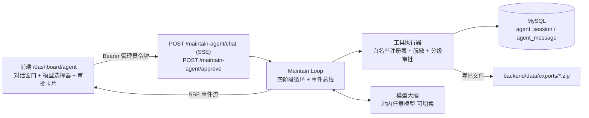

# AgenticAPI 站点维护 Agent · 设计与功能文档

> 文档版本：v1.5（v1.0 实施于 v0.9.0；v1.1 增补审批式容器沙箱与渠道/模型 CRUD，实施于 v0.10.0；v1.2 合并原设计文档与功能清单并精简；v1.3 增补第 16 节工具与 Skill 速查清单附录；v1.4 增补第 17 节现存问题；v1.5 落地第 17 节三项改进——工具精简 36→23、审批三档位、上下文水位可视化，并重构沙箱 MySQL 桥接与 data-governance 技能，实施于 v0.11.0）｜ 日期：2026-11-07

## 1. 形态概述

**"白名单工具 + 服务端工具循环 + 人审阀门 + 站内模型即 Provider"的对话式运维 Agent**，入口 `/dashboard/agent`（仅管理员）。

把分散在各管理页的运维能力（渠道管理、用量监控、模型拨测、数据治理等）下沉为**白名单工具**，由对话式 Agent 编排执行——管理员一句话完成"测一下所有渠道"、"统计并清理三个月前的日志"、"出一份巡检报告"这类复合任务。

四条核心特征：

- **大脑可插拔**：驱动模型可切换为站内任意已启用模型（走中转链路，天然享受渠道轮询容错），会话中途可换；
- **手是白名单 + 一个审批式沙箱**：23 个封闭注册的工具，宿主机上无 shell、无任意命令、无通用文件访问；唯一长尾出口是 `sandbox_exec`——隔离容器内执行、是否弹卡由会话审批档位决定；
- **高危有阀门**：写操作按会话**审批三档位**（需要审批 / 部分审批 / 完全权限）决定弹卡范围，L2 删除类另有 dry-run 两段式第二道闸，L2 每会话 5 次上限任何档位生效；
- **全程留痕**：会话消息（含工具与审批轨迹）服务端持久化，工具执行另写 `logs` 审计。


```mermaid
flowchart LR
    FE["前端 /dashboard/agent<br/>对话窗口 + 模型选择器 + 审批卡片"]
    API["POST /maintain-agent/chat (SSE)<br/>POST /maintain-agent/approve"]
    LOOP["Maintain Loop<br/>四阶段循环 + 事件总线"]
    TOOLS["工具执行器<br/>白名单注册表 + 脱敏 + 分级审批"]
    BRAIN["模型大脑<br/>站内任意模型·可切换"]
    DB[("MySQL<br/>agent_session / agent_message")]
    FE -->|Bearer 管理员令牌| API --> LOOP
    LOOP <--> BRAIN
    LOOP --> TOOLS --> DB
    LOOP -->|SSE 事件流| FE
    TOOLS -->|导出文件| FILES["backend/data/exports/*.zip"]
```

核心机制借鉴了成熟 Coding Agent Harness 的四阶段循环、Error as Data（错误回传模型自愈）、输出截断时拒绝执行工具、Skills 目录按需加载、执行中插话排队等设计，并按运维场景改造；两点关键差异——模型侧从"固定 Provider"改为"站内模型即 Provider"，工具侧坚持封闭白名单、不引入宿主机通用工具（容器沙箱是唯一受控例外）。

三条产品红线（贯穿所有功能，详见第 9 节）：

1. **密钥不可见**：上游密钥只在后端内存与库表中，模型上下文、前端、落库三处均为掩码版；
2. **无未审批的 shell**：宿主侧封闭白名单，任意命令仅存在于隔离容器且每条强制审批；
3. **高危必人审**：破坏性操作必须管理员确认，全过程审计落库。

## 2. Agent 循环与护栏

主循环四阶段（`maintain_loop`），执行期间管理员的新消息入队、下一轮合并（插话不中断）：

| 阶段 | 职责 |
|---|---|
| ① queue | 消费新消息与执行期间的插话，合并为 user 消息 |
| ② prepare | 请求装配（唯一转换边界）：读会话当前模型、审批档位与窗口 → 历史脱水检查 → 注入 system prompt（角色 + 安全规则 + 工具目录 + skill 目录）与 tools 白名单 |
| ③ execute | 流式调用模型（SSE 透传给前端）；收到 tool_calls 则走工具执行器，结果以 role:tool 回传进入下一轮 |
| ④ settle | 本轮 usage 计账、消息落库；检查轮次 / token 预算 / L2 次数，决定继续或 `[DONE]` 收尾 |

护栏参数：

| 护栏 | 默认值 | 说明 |
|---|---|---|
| 单次工具循环轮数 | 24 | 防死循环烧 token |
| 单工具超时 | 30s（批测类自声明 180s） | 超时返回 isError 回传模型 |
| 会话 token 预算 | 200k（会话可调） | 超预算 Agent 汇报后停止 |
| L2 每会话执行上限 | 5 次 | 超出拒绝并提示走管理页 |
| 审批等待超时 | 300s | 超时自动拒绝 |

关键防御机制：

- **截断防御**：`finish_reason == "length"`（输出被截断）时，本轮全部 tool_calls 判失败不执行——防残缺参数触发危险操作；
- **Error as Data**：任何失败（参数错、超时、上游 5xx、审批被拒）不中断 SSE、不抛异常，统一包装 `{isError: true, message}` 回传模型，由模型自我修正（如纠正渠道名拼写）或向管理员求助；仅会话级致命错误（数据库失联）走 SSE error 收尾。

## 3. 模型接入与计费

Agent 大脑的每次请求**不走独立 LLM SDK，而走本站中转链路**（`relay_service` 扩展 `source="agent"` 分支）：模型校验、渠道轮询容错、模型名映射、计费、用量统计与普通中转完全一致，**唯一差异是不写 chat_record**（维护对话独立存储，避免混进业务监控页）。

模型切换三途径：前端选择器（下一轮生效）/ 对模型说"换 glm-4.7 继续"（`switch_model` 工具，推送 `model_switched` 事件）/ 默认模型解析链（system_config → `.env` → 内置推荐值）。切换时若上下文超出目标模型窗口 70% 则先脱水压缩；目标模型不支持 function calling 时剥掉 tools 降级为纯对话并提示。

计费口径：

- **Agent 大脑调用**：完全复用中转计费链路，按模型定价扣**管理员个人余额**、cost 如实写 logs（不做免计费豁免，余额不足时链路自然 402，Agent 提示管理员）；
- **拨测类工具**：直发上游免计费（不经中转，消耗可忽略）；
- **查询 / 导出类工具**：只读，无模型消耗。

## 4. 工具系统与审批阀门

### 4.1 注册表与执行流水线

每个工具是注册表中的一个声明式条目（schema + 风险等级 + 超时 + handler），主循环不感知具体工具；扩展新工具只挂注册表，不改主循环。发给模型的 tools 列表恒为全部白名单工具（v0.11.0 起不再按会话开关裁剪，弹卡行为由档位在阀门处控制）。

每次工具调用必经的执行流水线：

```
解析 tool_calls → 截断防御 → 参数 Schema 校验（失败回传可行动原因）
  → 风险阀门（L0 直行 / L1·L2 按会话审批档位）→ 执行
  → 结果脱敏 redact() → 截断（≤8KB，摘要式）
  → role:tool 回传 + agent_message 落库 + logs 审计 + SSE 事件
```

### 4.2 风险分级与审批三档位（v0.11.0）

工具自身的风险分级保留两个用途：审批卡展示、部分审批档的弹卡判据：

| 级别 | 定义 | 工具 |
|---|---|---|
| L0 | 只读 / 无副作用 | 查询、拨测、统计、巡检、联网搜索等 15 个 |
| L1 | 低危写 | `update_channel` / `update_model` + 强审名单 4 个（`create_channel` / `create_model` / `save_skill` / `delete_skill`）+ `sandbox_exec` |
| L2 | 高危写：不可逆删除 | `delete_channel` / `delete_model`（两段式 dry-run） |

会话审批档位（`agent_session.approval_mode`，右栏下拉切换）决定 L1/L2 是否弹卡：

| 档位 | 值 | 弹卡范围 |
|---|---|---|
| 需要审批（默认） | `confirm_all` | 所有 L1/L2 写操作（含沙箱命令） |
| 部分审批 | `confirm_critical` | 仅 L2 高危 + always_confirm 强审名单（`create_channel` / `create_model` / `save_skill` / `delete_skill` / `sandbox_exec`），其余 L1 直行 |
| 完全权限 | `full` | 全部直行不弹卡；**L2 每会话 5 次上限仍然生效**（护栏非审批） |

两个不变量：

- **L2 两段式**：`delete_channel` / `delete_model` 首次调用 `dry_run=true` 只做影响预览（如删除渠道会产生哪些孤儿引用），管理员在审批卡上看到预览并批准后，第二次 `dry_run=false` 才真执行——两段式是工具内部逻辑，与档位无关；
- **旧开关兼容**：v0.10.x 的 `auto_approve_l1` / `enable_l2` 两列保留不再写入，读取时 `approval_mode` 为空则由旧值推导（`auto_approve_l1=true → confirm_critical`，否则 `confirm_all`）。

审批实现要点：审批状态内存 Event + 同步落库（`agent_message.approval_status`）；服务重启后未决审批一律置 timeout；approve 端点校验审批归属当前管理员；被拒结果以 isError 回传模型且同参调用做一轮冷却。分级阀门是**代码强制路径**（handler 入口第一行检查），与模型是否"听话"无关，不依赖 prompt 约束。

## 5. Skills 机制（按需加载的运维 SOP）

- 存放两处合并加载：`backend/app/agent_skills/*.md`（内置，随代码部署）+ `backend/data/agent_skills/*.md`（管理员自定义，覆盖同名内置）；
- 格式：frontmatter（name / description / triggers）+ 正文 SOP；**system prompt 只注入目录**（每条一行），全文由 `load_skill`（L0）按需读取，控制每轮固定 token 开销；
- 触发：模型按目录 description / triggers 自行匹配，或管理员显式指定；Skill 全文进入上下文后作为软约束（可按实际情况跳步，偏离需说明理由）。

6 个内置 Skill：

| Skill | 内容要点 |
|---|---|
| `site-inspection` | 巡检编排：渠道连通 → 模型巡检 → 额度水位 → 存储水位 → 评分卡报告 |
| `data-governance` | 数据治理（v0.11.0 沙箱连库版）：数据表现状说明 + 沙箱 pymysql 脚本完成容量统计、样本预览、分批清理与复核 |
| `channel-troubleshooting` | 渠道排障：复现 → 归因（连通 / 凭证 / 额度 / 映射）→ 处置建议 |
| `quota-watchdog` | 额度水位研判：三窗口解读、预警阈值（80% 橙 / 95% 红）、临期提醒 |
| `model-onboarding` | 新模型上线检查单：定价 → 渠道绑定 → 拨测 → 上线文案 |
| `incident-review` | 故障复盘：时间范围 → logs 检索 → 时间线 → 根因 → 改进项 |

自定义教学保存：管理员可让 Agent 把现场总结的经验固化为新 skill（`save_skill` / `delete_skill` / `list_skills`）。安全约束——写操作 always_confirm 强制全文审批；落盘前过 `redact()`；name 强制 slug 校验防路径穿越；单文件 ≤32KB；仅可写 `data/agent_skills/` 单目录，内置 skill 物理隔离不可覆盖；保存 / 删除各写一条 admin 日志。

## 6. 上下文管理

运维会话历史短（通常 ≤24 轮），压力主要来自**工具结果**（全量巡检报告、日志明细）。两级策略：

1. **脱水（主策略）**：已被消费的隔轮工具结果（距最新消息 >4 轮）替换为一句话占位摘要，tool_call 与 tool_result 成对替换；
2. **压缩（兜底）**：估算 token 超过当前模型窗口 70% 时，把脱水后的早期历史折成结构化摘要消息替换原历史；切换小窗口模型时立即检查。

**水位可视化（v0.11.0，第 17.1 项）**：右栏"上下文水位"卡片用进度条展示 已用 / 上限（模型 `context_length`）。已用口径是 `round_end` 事件新增的 `contextTokens`——最近一轮官方 `prompt_tokens`（当前上下文真实占用），而非累计消耗的 `usageSoFar`（含已被脱水历史）；切会话时从历史最后一条 assistant 消息的 `prompt_tokens` 恢复。≥70% 橙色（即压缩阈值）、≥90% 红色。

## 7. 数据持久化

两张表（完整字段见[数据库设计文档](数据库设计文档.md) 5.12 / 5.13 节，启动自动建表）：

- **`agent_session`**：会话（所属用户、标题、当前模型、审批档位 `approval_mode`（v0.11.0，旧 `auto_approve_l1`/`enable_l2` 列保留兼容）、状态）；
- **`agent_message`**：全轨迹消息（role / content / tool_calls / 风险等级 / 审批状态 / token 用量）。**落库的是 redact() 之后的版本**，库里不存密钥原文；导出文件不进消息表，只在 content 里留下载链接。

审计双轨：`agent_message`（会话视角完整轨迹）+ `logs`（type=admin 全站审计流，含审批状态变迁）。

会话保留策略：每用户最多保留**最近 50 个**、仅保留**近 30 天**；新建会话时后台惰性清理（联动删消息，写 admin 日志），不引入定时任务。

## 8. SSE 协议（事件清单）

正文走 OpenAI 风格增量（`choices[0].delta.content / reasoning_content`），站内扩展统一挂 `agenticapi_agent` 字段：

| 事件 | 载荷要点 | 前端渲染 |
|---|---|---|
| `tool_start` | `{tool, digest}` | 工具状态条（"正在测试渠道 zai …"） |
| `tool_progress` | `{tool, done, total}` | 批测进度（18/30 模型） |
| `tool_end` | `{tool, ok, summary}` | 状态条转结果（成功绿 / 失败红 + 摘要） |
| `confirm_required` | `{approvalId, tool, args, impact, riskLevel, expiresIn}` | **审批卡**：参数 + 影响预览 + 倒计时 + 批准/拒绝 |
| `confirm_resolved` | `{approvalId, result}` | 卡片置灰标注结果 |
| `model_switched` | `{from, to}` | 模型联动 + 轻提示 |
| `round_end` | `{round, usageSoFar, contextTokens}` | 用量脚注 + 右栏上下文水位更新（v0.11.0） |
| `sandbox_output` | `{tool, chunk}` | 沙箱实时输出（折叠控制台） |
| `dehydrated` | `{tool, summary}` | 折叠占位提示（长会话） |

错误语义：会话级致命错误返回 `data: {"error": {…}}` + `[DONE]` 收尾；401 复用前端现有拦截逻辑。

## 9. 安全红线

1. **密钥闭环**：渠道密钥仅存在于后端内存与 `llm_channels` 表；所有工具返回值经 `redact()` 递归脱敏（键名匹配 `api_key/token/password/authorization/cookie` 的字段替换为尾 4 位掩码，长文本内嵌的 `sk-…` / `Bearer …` 子串同样掩码）后才进模型上下文、前端、消息表——三处同源同过滤器；`agent_message.tool_calls` 落库与历史回显用脱敏版（执行仍用原文）；
2. **封闭工具面**：宿主机侧无 shell、无通用文件读写、无 SQL 直通（每个 handler 是显式函数，参数经校验）。prompt 注入最坏只能诱导模型调白名单工具；`sandbox_exec` 是唯一任意命令入口——容器隔离 + 弹卡与否由审批档位决定（v0.11.0：confirm_all / confirm_critical 档必弹，full 档直行）；
3. **鉴权**：`/maintain-agent/*` 全部 `get_current_admin`；approve 校验审批归属；导出 token 一次性 + 24h 过期；
4. **审计**：工具执行、审批变迁、模型切换全落库（双轨）；
5. **数据库安全**：数据治理走沙箱内 pymysql 脚本（data-governance 技能 SOP）：先 COUNT 预览再分批 DELETE（每批 5000 行 + 批间休止），禁 TRUNCATE / DROP / ALTER；DELETE 仅限 logs / chat_record / usage_stats 三表，凭证列（`llm_channels.api_key` / `user.password`）禁查，SELECT 显式列名不用 `SELECT *`；
6. **资源护栏**：轮次 / 单工具超时 / token 预算 / L2 次数四重上限（L2 上限任何审批档位生效）；批测并发信号量限 5；
7. **截断防御**：模型输出被截断时其工具调用一律拒绝执行。

## 10. 容器沙箱（v1.1；v1.5 增补 MySQL 桥接）

`sandbox_exec` 在隔离 Linux 容器内执行任意命令（镜像 python:3.12-slim + curl / jq / httpx / pymysql，可出公网），覆盖定制工具无法覆盖的长尾场景：给定 base_url/key/model 直发验证、拉上游 `/v1/models` 对比定价、脚本化批量诊断，以及 v0.11.0 起的**站内数据治理**（连接 MySQL 跑 data-governance 技能脚本）。

| 维度 | 设计 |
|---|---|
| 容器模型 | 全站共享单容器；会话间以 `/workspace/s{会话id}` 工作目录隔离；容器停止即清空（无持久化诉求） |
| 生命周期 | 懒启动（首个获批命令触发镜像按指纹懒构建，Dockerfile 或任一镜像源配置变化自动重建）→ 空闲 900s 自动 `docker stop`（保留容器与镜像，下次秒级拉起） |
| 驱动 | docker CLI 子进程（零新依赖，Windows 本机与 Linux 云端行为一致）；`SANDBOX_DOCKER_CMD` 可配 `sudo -n docker` |
| 隔离加固 | 独立网桥、非 root、`--cap-drop ALL` + `no-new-privileges`、只读 rootfs + tmpfs、内存 / CPU / pids 限额、不挂载宿主路径与 .env，不注入渠道密钥 |
| MySQL 桥接（v0.11.0 可选） | `SANDBOX_MYSQL_HOST` 配置后向容器注入 `MYSQL_HOST/PORT/USER/PASSWORD/DATABASE` 环境变量（凭证复用 MysqlSettings 或 `SANDBOX_MYSQL_USER/PASSWORD` 覆盖），三种取值：`host` 经 host-gateway 访问宿主机（本地开发）；`container:<名称>` 把沙箱接入该 MySQL 容器所在网络以容器名直连（生产 MySQL 只绑宿主回环也能通）；其他值按主机名/IP 直连。留空则与数据库隔离如旧 |
| 执行语义 | 命令经容器内 `timeout` 包裹；stdout/stderr 流式经 `sandbox_output` 事件推前端（节流 + 保尾部 64KB）；最终结果过 `redact()` + 8KB 截断（mysql:// 连接串与 MYSQL_PASSWORD 键均在掩码规则内） |
| 审批 | L1 + always_confirm：卡片展示完整命令；是否弹卡由会话审批档位决定（confirm_all / confirm_critical 档必弹，full 档直行），不占 L2 配额 |
| 配置 | `SANDBOX_*` 共 12 项全部可选有默认值（见 `backend/.env.example`）；换 `SANDBOX_BASE_IMAGE` / `SANDBOX_PIP_INDEX_URL` / `SANDBOX_APT_MIRROR` 任意一项自动触发镜像重建 |

`sandbox_status`（L0）查询 Docker 可用性 / 镜像就绪 / 容器状态 / 空闲时长。

残余风险：沙箱可访问公网任意地址（功能需求本身）；MySQL 桥接开启后沙箱持库凭证（docker env 注入，同宿主 .env 同级暴露面，管理员可为沙箱单独建最小权限账号）；容器与宿主共享内核（Docker 隔离级别，非 VM）；审批卡是否弹出取决于档位，full 档下管理员应在了解风险后再开启。

## 11. 前端交互

三栏布局：会话侧栏（新建 / 清空 / 删除）+ 对话窗口（消息流、工具状态条、审批卡、沙箱折叠控制台、输入框 + 停止按钮，头部含模型选择器）+ 右侧面板（**审批档位下拉**、**上下文水位进度条**、风险等级图例、帮助弹窗）。

实现要点：消息列表复用工坊 `ChatMessages.vue`（纯展示组件）；输入框新写 `AgentInput.vue`；SSE 解析复用工坊解析骨架并泛化，新增 `agenticapi_agent` 事件分发；审批批准 / 拒绝调 `POST /maintain-agent/approve`；上下文水位的窗口上限取模型列表 store 的 `contextLength`，已用取 `round_end.contextTokens`（切会话从历史最后一条 assistant 消息恢复）。

## 12. 功能清单（23 工具 + 内建能力）

按域分组的全部工具（等级与第 4.2 节分级对应；明细一句话说明，参数以注册表 schema 为准；仅看名字与等级的速查版见第 16 节附录）：

### A. 渠道管理（6）

| 功能 | 工具 | 等级 | 说明 |
|---|---|---|---|
| A1 渠道查询 | `list_channels` | L0 | 全量渠道信息与绑定关系，密钥只回尾 4 位 |
| A2 渠道连通测试 | `test_channel` | L0 | 注入密钥直发极小探测请求，单模型抽查或全模型遍历（并发限 5），免计费 |
| A3 渠道配置修改 | `update_channel` | L1 | 启停 / 超时 / 描述 / 支持模型；审批卡展示字段级 diff；**不改密钥**（走管理页） |
| A4 绑定一致性检查 | `check_binding_consistency` | L0 | 渠道-模型双向软引用交叉比对，输出不一致清单与修复建议，只报告不修复 |
| A5 新增渠道 | `create_channel` | L1+强审 | 新上游接入；密钥仅入参→落库瞬时存在，审批卡只显尾 4 位 |
| A6 删除渠道 | `delete_channel` | L2 两段式 | dry-run 预览反向绑定影响（孤儿引用），确认后真删 |

### B. 上游用量（1）

| 功能 | 工具 | 等级 | 说明 |
|---|---|---|---|
| B1 用量与凭证 | `get_upstream_status` | L0 | 各上游 TokenPlan 5h / 周 / 月三窗口用量 + 各凭证到期时间（≤7 天标 urgent）一次返回（v0.11.0 由 get_upstream_usage / get_token_expiry 合并） |

### C. 出站模型（6）

| 功能 | 工具 | 等级 | 说明 |
|---|---|---|---|
| C1 模型查询 | `get_model_info` | L0 | 定价 / 分组 / 渠道绑定（含映射）/ 状态 / 窗口 |
| C2 单模型拨测 | `test_model` | L0 | 按绑定渠道顺序逐个直发探测（免计费），返回每渠道结论 |
| C3 全量巡检 | `test_all_models` | L0 | 遍历全部启用模型拨测（并发限 5、总超时 180s、进度实时上报），汇总可用率 + 失败清单 |
| C4 新增模型 | `create_model` | L1+强审 | 含定价四件与渠道绑定；定价决定计费，审批卡展示完整配置 |
| C5 模型配置修改 | `update_model` | L1 | 字段级 diff 预览；模型名不可改；可解绑 / 改绑渠道 |
| C6 删除模型 | `delete_model` | L2 两段式 | dry-run 展示渠道侧孤儿声明影响，确认后真删 |

新上游标准上线链路：`create_channel` → `test_channel` → `create_model` → `test_model`。

### D. 数据治理（0 工具，改由技能 + 沙箱承载）

原 8 个数据治理工具（chat_record / logs / usage_stats 的统计、导出、清理）于 v0.11.0 下线，改由 **`data-governance` 技能 + 容器沙箱 pymysql 脚本**承担：容量统计（information_schema）、样本预览（显式列名 LIMIT）、分批清理（COUNT 预览 → 管理员确认 → 每批 5000 行分批 DELETE）。全量导出 / 备份不再由 Agent 提供（沙箱 stdout 上限 64KB 无法回传大文件），需要时登服务器用 mysqldump。`generate_health_report` 的存储水位仍由内部 `_table_stats` 支持。

### E. 运营速查（2）

| 功能 | 工具 | 等级 | 说明 |
|---|---|---|---|
| E1 站点概览 | `get_site_overview` | L0 | 今日 / 昨日调用与消费、用户数与活跃、全站余额池 |
| E2 用量趋势 | `get_usage_trend` | L0 | 时间范围 + 粒度的每模型调用量 / token / 费用序列（回传 Top5 摘要） |

### F. 系统内建（harness 能力）

- **F1 一键巡检**：`generate_health_report`（L0）聚合 A2 + C3 + B1 + 存储水位，按 `site-inspection` skill SOP 产出评分卡报告；仅由管理员对话触发，**不做定时巡检**；
- **F2 工具执行审计**：内建——每次执行（含被拒）写 admin 日志，可回答"Agent 昨天都干了什么"；
- **F3 会话管理**：内建——服务端持久化、历史列表、继续对话、删除、自动起标题（复用现有起标题逻辑）；
- **F4 模型切换**：仅前端选择器（v0.11.0 起 `switch_model` 工具下线，切换下一轮生效）；
- **F5 Skills**：`load_skill` / `list_skills` / `save_skill` / `delete_skill`（第 5 节）。

### G. 容器沙箱

| 功能 | 工具 | 等级 | 说明 |
|---|---|---|---|
| G1 沙箱命令执行 | `sandbox_exec` | L1+强审 | 隔离容器内执行任意命令，卡片展示完整命令；弹卡与否由审批档位决定（设计见第 10 节） |
| G2 沙箱状态查询 | `sandbox_status` | L0 | Docker 可用性 / 镜像就绪 / 容器状态 / 空闲时长 |

### W. 联网搜索

| 功能 | 工具 | 等级 | 说明 |
|---|---|---|---|
| W1 联网搜索 | `web_search` | L0 | 复用工坊 StepSearch 通道（0.04 元/次），查上游公告 / 定价 / 报错；未配密钥返回降级提示 |

### 明确不做的边界

| 不做的事 | 原因 |
|---|---|
| 宿主机 shell / 任意命令 / 通用文件访问 | 安全红线；唯一例外是隔离容器内的 `sandbox_exec`（按审批档位弹卡） |
| 删除用户 / 改余额 / 封禁 / 分组 | 资金与权限敏感，保留在用户管理页 |
| TRUNCATE / DROP 任何表 | 沙箱清理脚本只允许带条件分批 DELETE，可审计可中断 |
| 服务端定时巡检 / cron | 巡检仅由管理员对话触发（已决策） |
| Agent 对话写 chat_record | 维护对话不属于业务中转，独立会话表存储 |
| 沙箱文件持久化 / 每会话独立容器 | 共享单容器 + 自停清空，控制服务器资源占用 |
| 大数据全量导出 / 自动备份下载（v0.11.0） | 沙箱 stdout 上限 64KB 无法回传大文件，导出链路随数据治理工具一并下线；需要时登服务器 mysqldump |

## 13. 验收口径

1. 每个工具在真实站点数据上实测通过，返回 JSON 过脱敏过滤器；
2. L0 结果 ≤8KB（超出自动摘要化）；
3. L2 全程留痕：审批记录 + dry-run 预览 + 实删行数 + admin 日志四者可在库中对齐；
4. 所有端点未登录 401、非管理员 403；
5. 巡检报告在 ≥10 模型 / ≥5 渠道规模下一分钟级生成（批测并发受控）；
6. 模型切换后同会话可继续执行工具任务，上下文不丢不超窗；
7. 计费可对账（logs cost 如实）；超限会话在下次新建时被清理且留日志；
8. skill 教学保存安全链路：非法 name 被拒、redact 后落盘、超限拒绝；
9. 三档位行为正确（v0.11.0）：confirm_all 全弹卡 / confirm_critical 仅 L2+强审+沙箱 / full 全直行且 L2 上限仍生效；
10. 沙箱 MySQL 桥接开启后，data-governance 脚本可统计真实行数且输出无明文凭证；关闭时行为同 v0.10.0。

## 14. 决策记录

| # | 决策 | 备注 |
|---|---|---|
| 1 | Agent 大脑调用走管理员个人消费，完全复用中转计费链路，不做豁免 | 后续功能一律以复用已有链路为优先 |
| 2 | 会话保留：每用户最近 50 个 + 近 30 天，新建时惰性清理，不做定时任务 | 不设"自查自清理"工具 |
| 3 | 开放 skills 教学保存（save/delete/list），带 always_confirm 等安全约束 | 第 5 节 |
| 4 | 不做定时巡检，巡检仅管理员对话触发 | F1 |
| 5 | 引入审批式容器沙箱，红线"无 shell"修订为"无未审批的 shell"；全站共享单容器 + 懒启动 + 空闲自停 | 第 10 节 |
| 6 | 开放渠道 / 模型 CRUD（L1 强审 / L2 两段式）；用户与余额仍不可由 Agent 操作 | 第 12 节 A / C |
| 7 | 新增 web_search 只读工具，复用 StepSearch 通道 | W1 |
| 8 | tool_calls 参数落库 / 回显 / 审批卡全部使用脱敏版，执行用原文 | 第 9 节 |
| 9 | 工具精简 36→23（v0.11.0）：rotate_channel_key / get_redeem_stats / query_users / switch_model 下线，get_upstream_usage+get_token_expiry 合并为 get_upstream_status，8 个数据治理工具改由 data-governance 技能 + 沙箱脚本承载，导出链路全下线 | 第 12 节、第 17.2 节 |
| 10 | 审批分级收敛为三档位（v0.11.0）：confirm_all / confirm_critical / full，L2 每会话 5 次上限任何档位保留 | 第 4.2 节、第 17.3 节 |
| 11 | 沙箱可选桥接站内 MySQL（SANDBOX_MYSQL_HOST 三种取值），data-governance 技能内置 pymysql 脚本模板；大数据导出不做（stdout 64KB 上限） | 第 10 节、第 12 节 D |

开放问题：模型"支持工具调用"名单目前用内置名单 + 运行时降级探测，后续可考虑给 `llm_models` 加 `supports_tools` 布尔列（需手动 DDL）。

## 15. 代码结构

| 位置 | 职责 |
|---|---|
| `app/services/agent/maintain_loop.py` | 四阶段主循环 + SSE 事件总线（round_end 带 contextTokens 水位） |
| `app/services/agent/registry.py` | 工具注册表 + 执行器流水线（校验 / 三档位阀门 / 截断 / 审计） |
| `app/services/agent/tools/` | 按域分文件的工具 handler（channel / usage / model / ops / skill / sandbox / web）；`data_tools.py` 仅存巡检用的 `_table_stats` 内部函数 |
| `app/services/agent/{skills,approvals,redact}.py` | skill 加载器、审批管理器、脱敏过滤器 |
| `app/services/{probe_service,sandbox_service}.py` | 拨测、容器沙箱（v0.11.0 起含可选 MySQL 桥接；export_service 已随导出链路删除） |
| `app/router/maintain_agent.py` | chat(SSE) / approve / sessions 端点 |
| `app/models/agent_{session,message}.py` | 两张表（启动自动建表；已有库需手动 ALTER 加 `approval_mode`，见 deploy.md） |
| `app/agent_skills/*.md` | 6 个内置 SOP（data-governance 为沙箱连库版） |
| `backend/sandbox/Dockerfile` | 沙箱镜像（python:3.12-slim + curl/jq/httpx/pymysql，运行时按指纹懒构建） |
| 前端 `views/Dashboard/AgentChat.vue` + `components/agent/*` + `api/agent.ts` + `stores/agent.ts` | 三栏对话页与组件（右栏：审批档位下拉 + 上下文水位进度条） |

## 16. 附录：工具与 Skill 速查清单

> 与代码逐一核对（`app/services/agent/tools/*.py` 的注册语句 + `app/agent_skills/` 目录），v0.11.0 精简后 23 个。分组编号与第 12 节一致。

### 16.1 工具（23 个）

| 类别 | 工具 | 说明 | 权限等级 |
|---|---|---|---|
| **A. 渠道管理（6）** | `list_channels` | 全量渠道信息与绑定关系，密钥只回尾 4 位 | L0 |
| | `test_channel` | 渠道连通拨测，单模型抽查或全模型遍历（并发限 5），直发上游免计费 | L0 |
| | `check_binding_consistency` | 渠道-模型双向软引用交叉比对，输出不一致清单与修复建议，只报告不修复 | L0 |
| | `update_channel` | 启停 / 超时 / 描述 / 支持模型修改，审批卡展示字段级 diff；不改密钥 | L1 |
| | `create_channel` | 新增上游渠道；密钥仅入参→落库瞬时存在，审批卡只显尾 4 位 | L1·强审 |
| | `delete_channel` | 删除渠道，dry-run 预览反向绑定孤儿引用后真删 | L2·两段式 |
| **B. 上游用量（1）** | `get_upstream_status` | 各上游 TokenPlan 三窗口用量 + 凭证到期（≤7 天标 urgent）一次返回 | L0 |
| **C. 出站模型（6）** | `get_model_info` | 定价 / 分组 / 渠道绑定（含映射）/ 状态 / 窗口查询，可单查或全量 | L0 |
| | `test_model` | 单模型拨测，按绑定渠道顺序直发探测（免计费），返回每渠道结论 | L0 |
| | `test_all_models` | 全量启用模型巡检（并发限 5、进度实时上报），汇总可用率 + 失败清单 | L0 |
| | `create_model` | 新增出站模型，含定价四件与渠道绑定；定价决定计费，审批卡展示完整配置 | L1·强审 |
| | `update_model` | 模型配置修改，字段级 diff 预览；模型名不可改，可改绑渠道 | L1 |
| | `delete_model` | 删除模型，dry-run 预览渠道侧孤儿声明影响 | L2·两段式 |
| **E. 运营速查（2）** | `get_site_overview` | 今日 / 昨日调用与消费、用户数与活跃、全站余额池 | L0 |
| | `get_usage_trend` | 时间范围 + 粒度的每模型调用量 / token / 费用序列（回 Top5 摘要） | L0 |
| **F. 系统内建（5）** | `generate_health_report` | 一键巡检：渠道连通 + 模型巡检 + 额度水位 + 存储水位 → 评分卡报告 | L0 |
| | `load_skill` | 按需读取指定 Skill 的完整 SOP 正文（目录常驻、全文按需，省上下文） | L0 |
| | `list_skills` | 列出技能池全部条目（内置 / 自定义、描述、触发词、更新时间） | L0 |
| | `save_skill` | 把运维经验固化为自定义 Skill；slug 校验、≤32KB、落盘前过 redact | L1·强审 |
| | `delete_skill` | 删除指定自定义 Skill（内置不可删） | L1·强审 |
| **G. 容器沙箱（2）** | `sandbox_exec` | 隔离容器内执行任意命令（curl / jq / python3+httpx/pymysql，可出公网、可连站内 MySQL），弹卡与否由审批档位决定 | L1·强审 |
| | `sandbox_status` | 查询 Docker 可用性 / 镜像就绪 / 容器状态 / 空闲时长 | L0 |
| **W. 联网搜索（1）** | `web_search` | 联网搜索（StepSearch 通道，0.04 元/次），查公告 / 定价 / 报错 | L0 |

风险分布：**L0 只读 ×15 ｜ L1 写 ×6**（其中 always_confirm 强制人审 ×5：`create_channel` / `create_model` / `save_skill` / `delete_skill` / `sandbox_exec`）**｜ L2 两段式 ×2**（`delete_channel` / `delete_model`）。

v0.11.0 下线清单：`rotate_channel_key`、`get_redeem_stats`、`query_users`、`switch_model`（换模型走页面选择器）、数据治理 8 个（`get_chat_record_stats` / `export_chat_records` / `cleanup_chat_records` / `get_log_stats` / `export_logs` / `cleanup_logs` / `get_aggregate_stats` / `cleanup_aggregate_stats`）。

### 16.2 内置 Skill（6 个）

| name | 一句话 |
|---|---|
| `site-inspection` | 站点巡检编排（渠道连通 → 模型巡检 → 额度/存储水位 → 评分卡报告） |
| `data-governance` | 数据治理·沙箱连库版（数据表现状说明 + pymysql 脚本：统计 → 样本预览 → 分批清理 → 复核） |
| `channel-troubleshooting` | 渠道排障（复现 → 归因 → 处置建议） |
| `quota-watchdog` | 上游额度水位研判（80% 橙 / 95% 红预警） |
| `model-onboarding` | 新模型上线检查单（定价 → 绑渠道 → 拨测 → 上线文案） |
| `incident-review` | 故障复盘（时间范围 → logs 检索 → 时间线 → 根因 → 改进项） |

自定义 Skill 经 `save_skill` 落 `backend/data/agent_skills/`（同名时加载优先于内置，内置文件本身不可改删，见第 5 节）。

## 17. 现存问题（2026-11-07 记录）

> 当前版本的已知问题与待改进项，逐项排期修复；完成后在本节对应条目标注修复版本。

### 17.1 缺少上下文窗口的可视化入口 ✅ 修复于 v0.11.0

- **现象**：前端没有展示当前会话驱动模型的上下文窗口上限（`context_length`），也没有"当前已占用多少上下文"的读数。上下文水位目前只在第 6 节的两级策略内部生效（超窗口 70% 触发压缩、隔轮工具结果脱水），管理员全程不可见。
- **影响**：无法预判"还能聊多久、什么时候会被压缩脱水"，长会话中只能从消息被折叠占位的蛛丝马迹里反向猜测；切换小窗口模型时上下文可能骤然被压缩，也没有提前感知。
- **修复**（v0.11.0）：右栏新增"上下文水位"卡片，进度条展示 已用 / 上限；已用口径为 `round_end` 事件新增的 `contextTokens`（最近一轮官方 prompt_tokens，比原设想的累计 usageSoFar 更准确——后者含已脱水历史，不代表当前上下文占用），切会话从历史最后一条 assistant 消息恢复；≥70% 橙 / ≥90% 红。见第 6、11 节。

### 17.2 工具与 Skill 数量偏多，需要精简 ✅ 修复于 v0.11.0

- **现象**：36 个工具 + 6 个内置 Skill（见第 16 节附录），对单一管理员的运维场景而言工具面偏大；部分工具使用频率低，或与既有管理页能力重叠。
- **影响**：每轮请求都携带全部工具的 JSON Schema 与 skill 目录，常驻 token 开销随数量线性上涨；工具越多，模型选择时的干扰面越大、误选率越高；每个工具的脱敏、审批、测试、文档维护成本也随之增加。
- **修复**（v0.11.0）：36 → 23（第 12、16 节）——`rotate_channel_key` / `get_redeem_stats` / `query_users` / `switch_model` 下线；`get_upstream_usage` + `get_token_expiry` 合并为 `get_upstream_status`；数据治理 8 工具改由重写的 `data-governance` 技能（沙箱 pymysql 脚本）承载，导出链路随之全下线；6 个内置 Skill 保留（仅 data-governance 重写、其余修订工具名引用）。

### 17.3 权限分级体系复杂，理解门槛高 ✅ 修复于 v0.11.0

- **现象**：现行分级为 L0 直行 / L1 审批 / L2 强审 + 两段式 dry-run + 每会话限次，叠加 always_confirm 强审名单（6 个）与会话级"L1 自动批准""L2 开关"两个开关（第 4.2 节），组合规则数量接近工具数的一半，且分散在审批卡、会话设置、文档多处表述。
- **影响**：管理员需要理解"哪些直接执行、哪些弹卡、哪些弹卡且不可豁免、哪些还要跑两次"的完整组合才能正确使用，使用理解门槛被显著抬高；新增工具时的风险定级也是持续的心智负担。
- **修复**（v0.11.0）：会话行为收敛为**审批三档位**（右栏下拉）：需要审批（默认，全部写操作弹卡）/ 部分审批（仅 L2 + 沙箱 + 强审名单）/ 完全权限（全直行，L2 每会话 5 次上限保留）；旧"L1 自动批准 / L2 开关"两开关及"只读模式"取消（L2 工具恒注入，由档位控审批），旧列保留兼容。见第 4.2 节。
